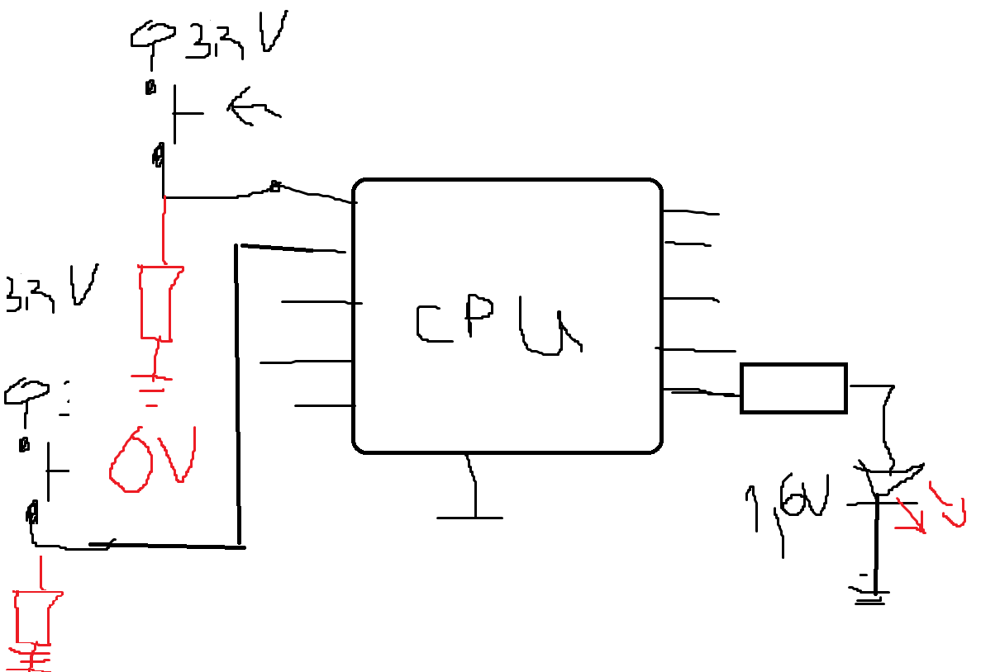

# Internet of Things (IoT)

### Основни характеристики:
- **Интелект**: Устройства с вграден микроконтролер, който управлява логиката.
- **Комуникация**: Способност за комуникация чрез различни мрежови технологии (Wi-Fi, Bluetooth и др.).

---

# Процесори

### Основни видове процесори:
- **CPU** (Central Processing Unit) / **MCU** (Microcontroller Unit) / **MPU** (Microprocessor Unit)
- Процесорите за компютри и тези за PCB (печатни платки) имат различни приложения:
  - **Големи процесори**: Използват се в компютри и мощни устройства.
  - **Малки процесори**: Подходящи за интегриране със сензори и други периферни устройства като микрофони, индикатори, и актуатори (напр. говорители).

### Пример:
- **Актуатори и трансдюсери**: Те могат да преобразуват електрическите сигнали в звук, светлина или други форми на енергия.
- **Пример с Noise Cancelling**: Процесорът обработва сигналите от микрофона и ги използва за намаляване на шума.

---

## Принцип на работа на процесорите:
- **Инструкции**: Процесорите изпълняват инструкции, които представляват елементарни операции (напр. увеличаване на променлива: `var + 1`).
  - Инструкциите са крайни и ясни, което ги прави лесни за изпълнение от хардуера.
  - Процесорите използват индикатори, за да проследяват напредъка на изпълнението.

---

## Памет:

### Основни типове памет:
- **Flash памет**:
  - **Съдържание**: Съдържа постоянните инструкции и данни на програмата. Тя е неизменяема при прекъсване на захранването.
  - **Пример за работа**:
    - A = 0x59 -> Задаване на адрес в паметта.
    - O = 0x03 -> Задаване на стойност на този адрес.
- **RAM памет**:
  - **Функция**: Използва се за временно съхранение на променливи и данни по време на изпълнение на програмата.
  - **Добри практики**: Не е добре да се записва често във Flash паметта, защото се износва при многократно писане (особено транзисторите вътре).
  - **HEAP и STACK**: RAM паметта е разделена на тези две структури, които управляват динамичното и статичното съхранение на данни.

### Къде се съхраняват данните?
- **Flash**: Константи, програмни инструкции и конфигурации.
- **RAM**: Временни променливи, данни и резултати от текущите изчисления.

---

## АЛУ (Аритметическо-логическо устройство):
- Процесорите използват АЛУ за изпълнение на базови аритметически и логически операции:
  - **Суматор**: Извършва събиране.
  - **Субстратор**: Извършва изваждане.
  - **Множител** и **делител**: Извършват умножение и деление.

---

## Регистри:
- **PC (Program Counter)**: Показва докъде е изпълнена програмата.
- **SP (Stack Pointer)**: Проследява текущото състояние на стека.
- **CR (Control Register)**: Управлява дали даден пин ще бъде вход или изход (напр. GPIO).
- **SR (Status Register)**: Отразява дали дадена инструкция е изпълнена.
- **GP (General Purpose)**: Универсални регистри за съхранение на временни данни.

---

# Връзване на процесор

### Необходими компоненти:
- **Бутони**: Два бутона за контрол.
- **Светодиоди**: Два светодиода за индикация.

### Основни стъпки:
1. **Захранване**: 
   - Захранването е ключово, като стандартните напрежения са: 1.2V, 1.8V, 2.4V, 3.3V и 5V. В този случай ще използваме 3.3V.
2. **I/O пинове**:
   - Процесорите имат множество входно-изходни пинове (I/O).
   - Някои пинове предават данни в двоична форма (1 и 0).
   - За по-сложни връзки се използват интерфейси, които управляват предаването на информация между процесора и външните компоненти (например комуникация по 3 жици).
3. **Терминиращ резистор**:
   - Резисторът се използва за стабилизиране на сигнала и предотвратяване на паразитни състояния на пина.
4. **Push & Pull конфигурации**:
   - **Push**: Осигурява стабилно високо ниво на напрежение (логическа 1).
   - **Pull**: Дава по-малко стабилно ниско ниво (логическа 0).

---

### Примерна схема с един бутон:

За да стане OR логика връзваме на същия pin още един бутон по същия начин.

### Примерна схема с два бутона:

---

### Изчисляване на резистор за светодиод:
- Използвайки закона на Ом за определяне на съпротивлението:
  - Желан ток: Ir = 10mA
  - Напрежение: Ur
  - Формула: 
    \[
    R = \frac{Ur}{Ir}
    \]
  - Примерно съпротивление: 170 ома.

---
оригинал:
Internet of Things:
- Имат интелект - микроконтролер
- имат способи за комуникация

Процесори:
- CPU/MCU/MPU
- има разлика между тези за компютри и тези за pcb-та - делят за на:
    - за малки и за големи
    - малките процесори дават възможност за свързване със сензори (микрофон)
    - актуатори/трансдюсери -> индикатори или изход от микропроцесора - взимат и предават (говорител)
    noice cancelling
- изпълняват зададени инструкции - елементарни операции (пример var + 1):
    - имат си индентикатор 
    - те са крайни
- памет
    - разделено е на клетки
        - те имат адрес (уникален)
        - size 
    - пример за работа:
        - A = 0x59  -> задаване на адрес
        - O = 0x03  -> задаване на стойност
    - в тази памет се пазят последователно инструкциите
    - трябва да е **постоянна памет** - когато се изключи захранването - да се пази, нарича се FLASH

    - Има RAM памет - "разгръща се програмата"
        - Когато имаме функция - тя се пази във flash, но когато я извикаме с конктретни стойности - тя е в RAM (защото са променливи)
        - не е добра практика да пипаме във flash-а, няма нищо ценно, износва се (при писане не при четене) - транзисторите вътре деградират
        - имат HEAP и STACK

    - в Flash се пазят константи, програмата, conf
    - в RAM - всичко останало

- команден интерпетатор - когато програмата се изпълнява получава индентификатор за фунция и го задейства. Това е реално НЕЩОТО което върши работа

- АЛУ - аритеметически логично устройство - елементарен калкулатор (+, -, *, /)
    - суматор - +
    - субстратор - -
    - множителя и делението 
- Регистри 
    - PC - програмен брояч (докаде се е изпълнила програмата)
    - SP - stack pointer 
    - CR - control register - дали дадено пинче ще е вход/изход - GPIO
    - SR - status register - дали е изпълнено
    - GP - general purpose

Връзване на процесор
- Да има:
    - два бутона
    - два светодиода
- За да работи
    - даваме захранване (стандартизирани напрежения: 1,2V; 1,8V; 2,4V; 3,3V; 5V) (но и тока е важен есте) - в нашия случай ще е 3,3V
    - всички процесори имат крачета - I/O  (Input/Output)
        - някои се използват за предаване на 1 и 0
        - има един компонент който предава по поне 3 жички нарича се - интерфейс
    - Push -> сигурна 1
    - Pull -> някво никво 
    - слага се терниращ резистор
- Един бутон:

- Ако искаме OR логика добавяме на същото краче а ако искаме да разберем кой бутон е настиснат:

    
- Искаме да тече ток Ir=10mA през резистора - закон на ОМ:
R = Ur/Ir -> 170 ома
- После същото за другия LED