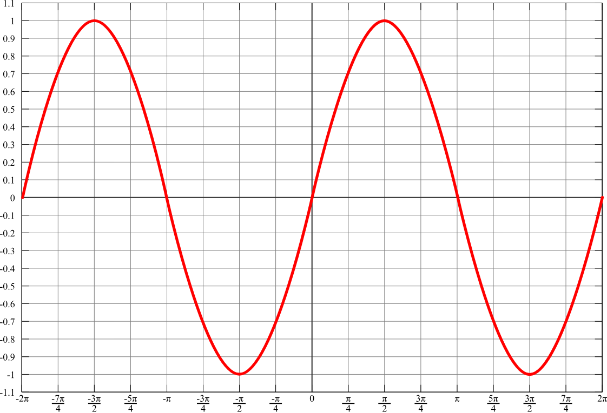
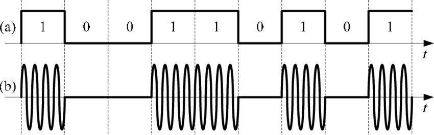
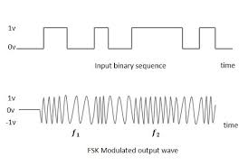
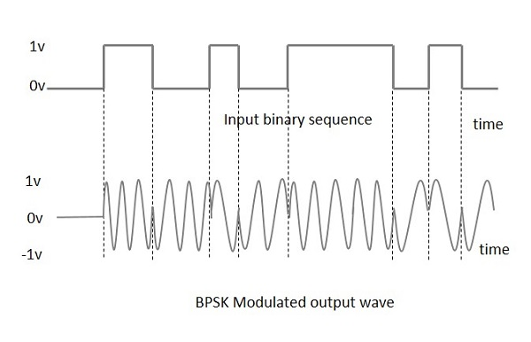
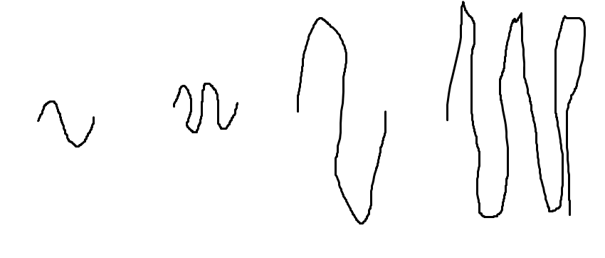
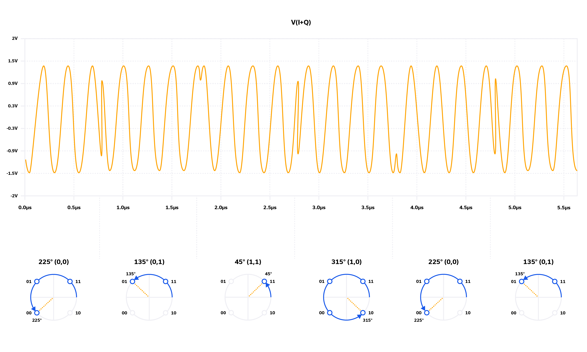
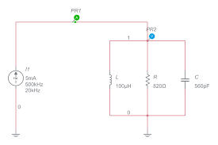

# Комуникация

## От миналия път
- Internet of Things устройствата имат способ за комуникация

## Дефиниция на комуникацията
- Две устройства се опитват да извършат обмен на данни чрез комуникационен канал, който може да бъде:
  - **Жичен** (напр. кабел)
  - **Безжичен** (напр. радио сигнал)

### Интерфейс
- Интерфейсът е физическата среда, в която се осъществява комуникацията. Ако е безжична среда, обикновено се използва радио канал. Един от ключовите параметри при безжичната комуникация е скоростта на предаване на данни, която зависи от капацитета на канала.

#### Капацитет на Шанън
- **Капацитет на Шанън** определя с каква максимална скорост може да се предават данни през радиоканал. Това зависи от два основни фактора:
  - **Широчина на канала** – колкото по-широк е каналът, толкова повече информация може да бъде предадена.
  - **Чувствителност на приемника** – по-чувствителните приемници могат да интерпретират слабите сигнали и да ги използват за предаване на информация.

### Модулация
Модулацията е процес, при който двоични данни (0 и 1) се превръщат в сигнал, който може да бъде предаден през комуникационната среда. Основните параметри на сигнала са:

- **Амплитуда** – височината на вълната.
- **Честота** – колко пъти в секунда сигналът осцилира.
- **Фаза** – положението на вълната спрямо даден референтен момент.



#### Основни видове модулация
##### 1. **ASK модулация** (Amplitude Shift Keying)
- При **ASK** модулацията информацията се предава чрез промяна на амплитудата на сигнала. За 1 амплитудата е по-висока, докато за 0 е по-ниска или нулева.



##### 2. **FSK модулация** (Frequency Shift Keying)
- При **FSK** модулацията се използват две различни честоти за представяне на 0 и 1. За 1 сигналът има по-висока честота, докато за 0 се използва по-ниска честота.



##### 3. **PSK модулация** (Phase Shift Keying)
- При **PSK** модулацията данните се предават чрез промяна на фазата на сигнала. Например, 1 може да бъде представена с промяна на фазата с 180 градуса, докато 0 остава без промяна.



### Комбинирани модулации
При чиста модулация (например само ASK, FSK или PSK) можем да предадем само 1 бит на синусоида. За да увеличим ефективността, можем да комбинираме различни методи:

#### **ASK + FSK модулация**
- Комбинирайки амплитудна и честотна модулация, можем да предаваме по 2 бита на синусоида, като всяка комбинация от амплитуда и честота представлява различна двоична стойност (00, 01, 10, 11).



#### **QAM модулация** (Quadrature Amplitude Modulation)
- **QAM** комбинира промени както в амплитудата, така и във фазата на сигнала. Тази техника позволява предаването на няколко бита на всяка синусоида и се използва в съвременните комуникационни системи за повишаване на ефективността.



### Обобщение на видовете модулация
1. **ASK** – поради уязвимост към шум, тази модулация не се използва често.
2. **FSK** – въпреки че е по-надеждна, тази модулация може да се влияе от външни фактори като Доплеров ефект.
   \* **FM** (честотна модулация) е различен вид модулация, при която честотата на сигнала се променя плавно.

   

3. **PSK** – най-устойчивата модулация, използвана широко заради своята надеждност.
4. **QPSK** – **Wi-Fi** използва **QPSK** (Quadrature Phase Shift Keying) на честоти 2.4 GHz и 5 GHz.
5. **BPSK** – **Wi-Fi HaLow** използва **BPSK** (Binary Phase Shift Keying) на 900 MHz, което позволява предаване на данни на по-големи разстояния с приемливи скорости.

## Протоколи
Протоколът е набор от правила, които определят начина, по който две устройства комуникират помежду си.

### Three-way Handshake
- При комуникация между две устройства, първоначално се изпълнява процесът **three-way handshake**. Това е синхронизация, при която двете устройства се договарят кой кога да слуша и кога да изпраща данни.

#### Формат на предаване на данни
- Данните се предават в рамките на структуриран формат, който включва:
  ```
  start | полезни данни | stop
  ```

- Колкото повече данни се предават, толкова по-сложен става протоколът. Пример за по-сложен формат:
  ```
  start | size | полезни данни | stop
  ```

#### Потвърждение на успешното предаване
- За да се гарантира, че данните са успешно предадени, приемникът изпраща обратно потвърждение (**ACK**). Освен това, за проверка на коректността на данните се използва **CRC** (цикличен код за проверка), който е част от **ECC** (код за корекция на грешки).

  ```
  start | size | полезни данни | CRC | stop
  ```

### ECC и защита от грешки
**ECC** (error correction code) е техника, използвана за откриване и коригиране на грешки при предаване на данни. Един пример за такава техника е **Рийд-Соломон** код, който се използва широко в комуникационните системи.

### Parity Bit (Бит на четност)
- **Бит на четност** е най-простата техника за откриване на грешки. Той проверява броя на единиците в данните. Ако броят е четен, битът на четност е 0, а ако е нечетен – 1.

#### Пример за предаване:
```
1 0 1 1 1 /0 
```

#### Пример за приемане:
```
1 0 0 1 1 /0 
```

Ако има несъответствие, данните се отхвърлят. Битът на четност открива **нечетен** брой грешки, но не е ефективен при откриване на четен брой грешки.

#### Проблем с четен брой грешки
Ако при предаване на данните се получи четен брой грешки, системата може да не ги засече. Пример:

```
Пращане: 1 0 1 1 1 /0
Получаване: 0 1 1 1 1 /0 
```

В този случай грешките не се улавят и приемникът приема данните за валидни.