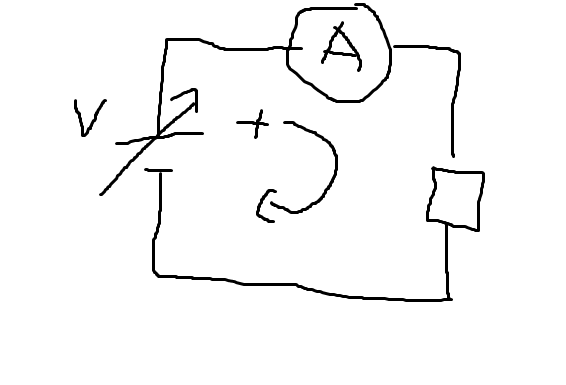
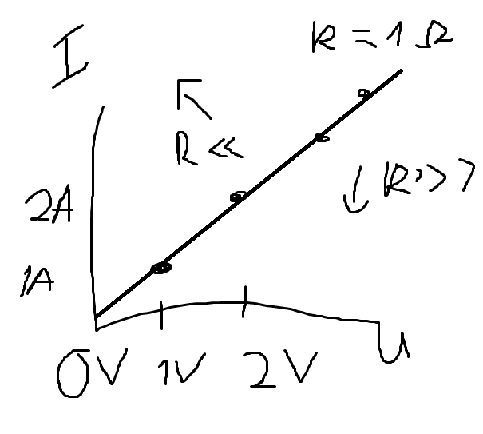
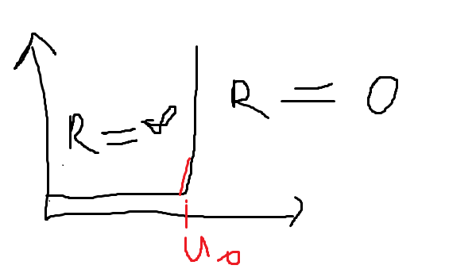
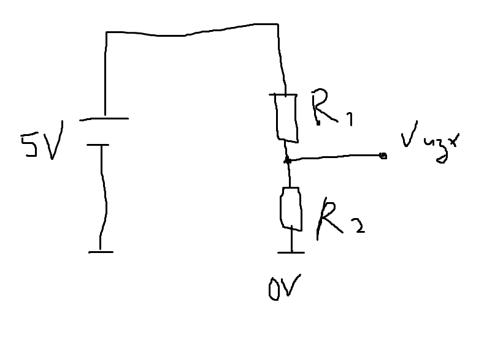
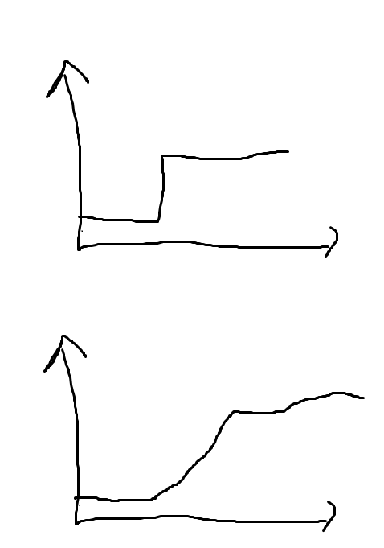
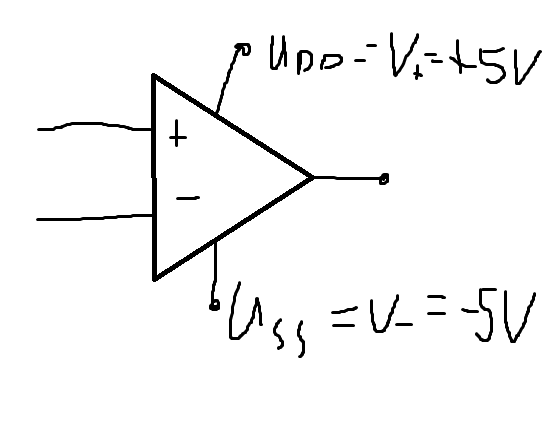
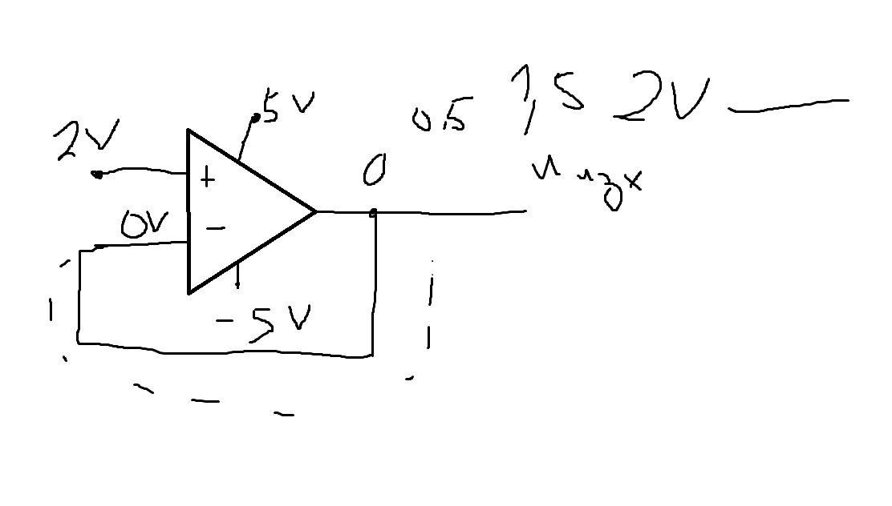
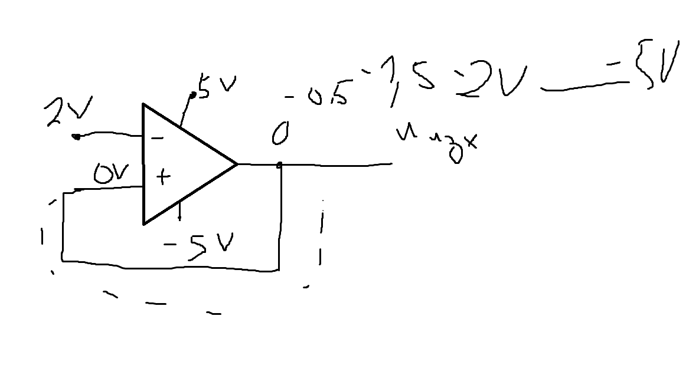
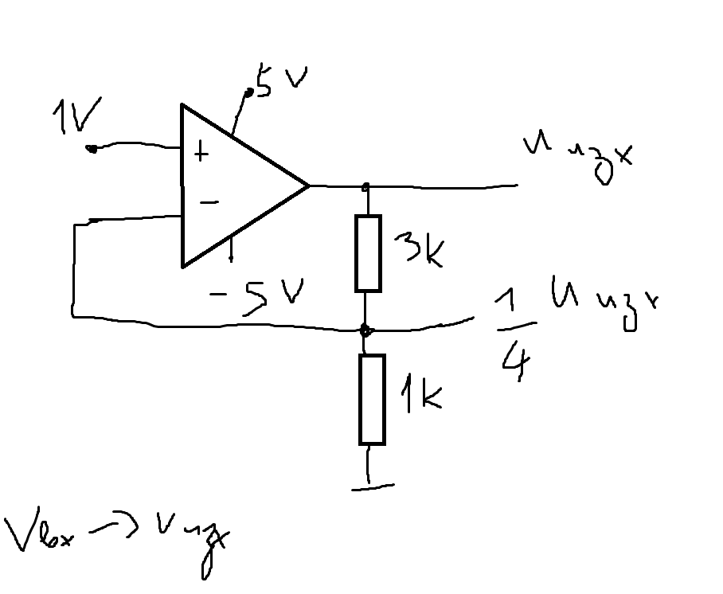
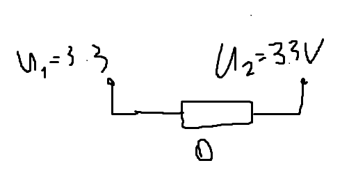

# Системи и техните компоненти

Една система се състои от по-малки части, които си комуникират чрез връзки, по които протичат **напрежение (V)** и **ток (I)**.

## Йерархия на компонентите
Компонентите на една система могат да бъдат разделени на две категории:

1. **Пасивни елементи**:
    - Резистор (R)
    - Кондензатор (C)
    - Индуктивност (L)
    - Трансформатор (T)
   
2. **Активни елементи**:
    - Диод
    - Транзистор

Всеки от тези елементи има свое обозначение в схемите.

## Връзка между напрежение и ток
**V** и **I** са взаимозависими. Основни зависимости между тях са:

- **Токът** (I) е функция на напрежението (U):  
  `I = f(U)`
- **Напрежението** (U) е функция на тока (I):  
  `U = f(I)`

Пример за такава зависимост е **законът на Ом**:
```md
I = U / R
```

## Експериментално наблюдение
Можем да направим експериментална постановка, за да проследим дали зависимостите са валидни. Схемата може да изглежда така:  


> Ако има стрелка върху елемента, това означава, че можем да го регулираме.

## Волтамперна характеристика
Тази зависимост между напрежението и тока се изобразява с волтамперна характеристика:


### Аналогия между напрежение и ток:
- **U** (напрежение) може да се асоциира с кокошка.
- **I** (ток) може да се асоциира с яйце.

Ако имаме **ток** (I), значи наблизо има и **напрежение** (U), но обратното не винаги е вярно.

## Диод и кондензатор
Перфектната диаграма на диод може да се види по-долу:  
  
**Uо** е отпускателното напрежение (threshold voltage).

За кондензатор важи следното:
```md
I_C = C * (dU_C / df)
```

## Закони на Кирхоф
Има два закона на Кирхоф:

1. **За тока** – Токовият закон на Кирхоф.
2. **За напрежението** – Напреженовият закон на Кирхоф:
```md
Σ(Vi) - Σ(Vo) = 0
```

## Енергия в схемите
В схемите имаме **източници на енергия** и **консуматори**. Източниците подават енергия, а консуматорите я черпят. При оразмеряване на схема се разглеждат две части – **източници** и **консуматори**. Напрежението и токът на входа трябва да бъдат равни на тези на изхода.

## Делител на напрежение
Един от важните елементи в схемите е **резисторният делител на напрежение**. Формулата за изходното напрежение е:
```md
U_изх = k * U_вх
```
Където:
```md
k = R2 / (R1 + R2)
```

Пример за схемата на делител на напрежение:


## Операционен усилвател (ОУ)
Операционните усилватели имат два входа и един изход. Основни правила за ОУ:

1. Ако **U+ > U-**, тогава изходът **U_изх** се увеличава. Ако го обърнем, **U_изх** намалява.
2. Изходът **U_изх** се променя бавно – нужно е време за предаване на сигнала.

3. **U_изх** е ограничено между **U_ss** и **U_DD**.

4. Входовете на ОУ не консумират ток.

### Повторител
Една от важните функции на ОУ е **повторителят**. Примерна схема:


Ако подадем напрежение от 2V, изходът ще започне бавно да го следва и ще достигне същите 2V. Ако подадем 10V, същото ще се случи, но ще се спре до 5V поради ограничението.

## Насищане и устойчивост
При достигане на определен лимит, системата достига до **насищане**. Това се нарича **устойчива система**, където може да се избегне удрянето в "тавана" чрез внимателно подаване на стойности. 

**Неустойчивите системи** удрят тавана и се характеризират с **положителна обратна връзка**.


## Усилвател
Усилвателната схема е подобна на тази на операционния усилвател, но с добавен делител на напрежение, който определя коефициента на усилване:
```md
K_усилване = 1 + (R2 / R1)
```


## Други елементи
- **Ферит** в зарядното устройство – помага за премахване на шумове.
- **Резистор 0 ома** – използва се за свързване на две захранвания, като предотвратява преминаването на шумове от едното към другото:

```

Това е версията на твоите бележки във формат `.md`. Тя е готова за използване в Markdown редактор или система за управление на съдържанието.