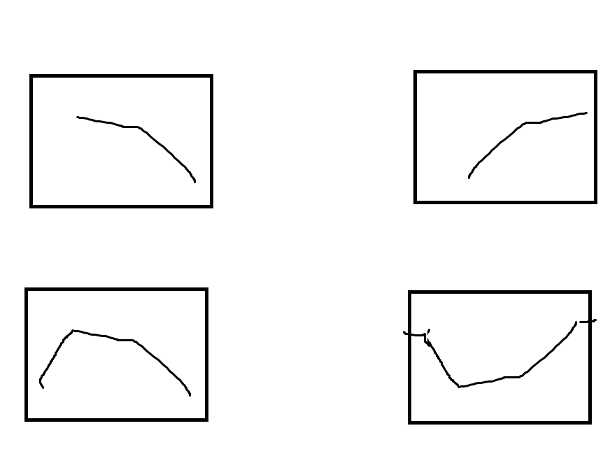
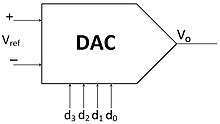
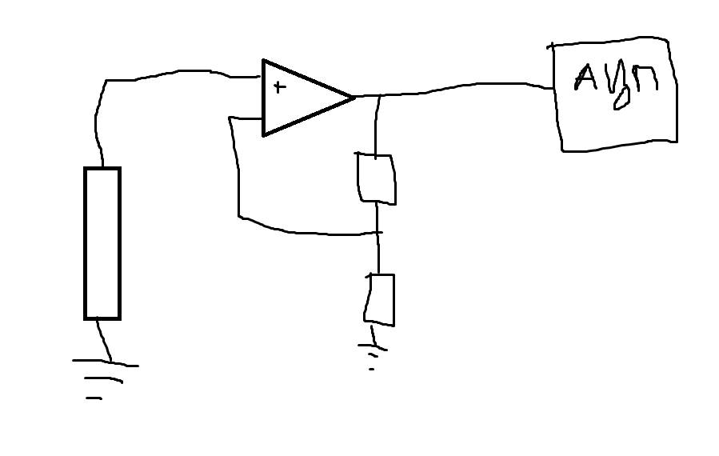

# Схеми за Събиране на Данни

Този файл предоставя информация за процеса на събиране и обработка на аналогови и цифрови сигнали. Основните компоненти на схемите са сензори, усилватели, филтри и преобразуватели, използвани за получаване на полезна информация от неелектрически величини, например температура.

## Сензори и Аналогова Част

Сензорите (S) преобразуват неелектрическите величини (например температура) в електрически сигнали. Природните явления като промени в температурата са плавни и следователно се измерват чрез аналогови сигнали, които се обработват с аналогови устройства.

### Усилвател

При малки промени в сигнала е необходимо усилване, което се осъществява с помощта на усилвател, увеличаващ амплитудата на сигнала. Например:


След усилването на сигнала се прилага филтриране.

## Филтри

При измерванията често има наличие на шум, който не съдържа полезна информация. За премахването му се използват филтри, които изчистват сигнала от нежелани честоти.

### Видове Филтри

1. **Нискочестотен филтър** - пропуска само нискочестотните компоненти.
2. **Високочестотен филтър** - пропуска високочестотните компоненти.
3. **Лентов филтър** - пропуска честоти в определен диапазон.
4. **Режекторен филтър** - премахва определена честота и пропуска всички останали.



Всеки сигнал може да бъде представен като сума от честоти. Полезната информация обикновено е в нискочестотната област, докато високочестотните компоненти често са шум.

### Аналогово към Цифрово Преобразуване (АЦП)

След премахването на шума сигналът се подава към аналогово-цифров преобразувател (АЦП), който преобразува аналоговия сигнал в цифров. 

### Цифрово към Аналогово Преобразуване (ЦАП)

Цифровият сигнал може да бъде преобразуван обратно в аналогов с цифрово-аналогов преобразувател (ЦАП), чието означение е както следва:



## Централен Процесор (CPU)

Накрая сигналът се обработва от процесор (CPU), който анализира и интерпретира данните.

## Проблеми при Усилвателите

При усилване до много високи напрежения усилвателите достигат своите граници. Например, ако работният обхват е между +5V и -5V, то не можем да достигнем 100V разлика. За преодоляване на тези ограничения се добавят транзистори.

### Диференциален Сигнал и Усилвател
**Диференциален сигнал** - разлика между две напрежения

Диференциалният усилвател измерва разликата между две напрежения. В медицината, например, се използва за измерване на ЕКГ сигнали, които са разлики между електродите, разположени върху тялото.

> **Забележка:** За тази схема резисторите трябва да са еднакви, за да се постигне коректно усилване.

## Генериране на Истински Случаен Шум

Генерирането на бял шум може да се постигне чрез Johnson шум, който се генерира от резистор. Формулата за този шум е:

```plaintext
en = sqrt(4 * k * T * R)
```


