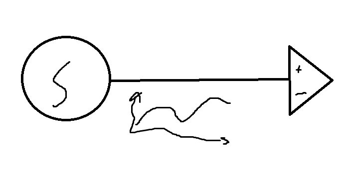
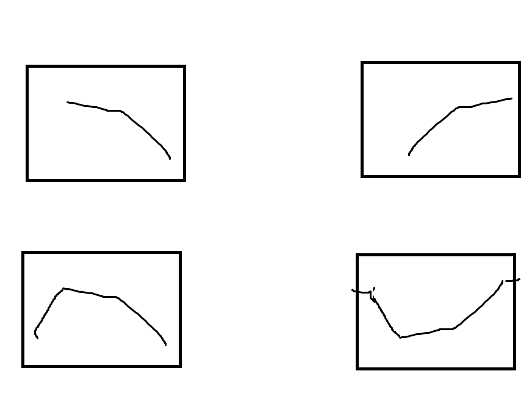
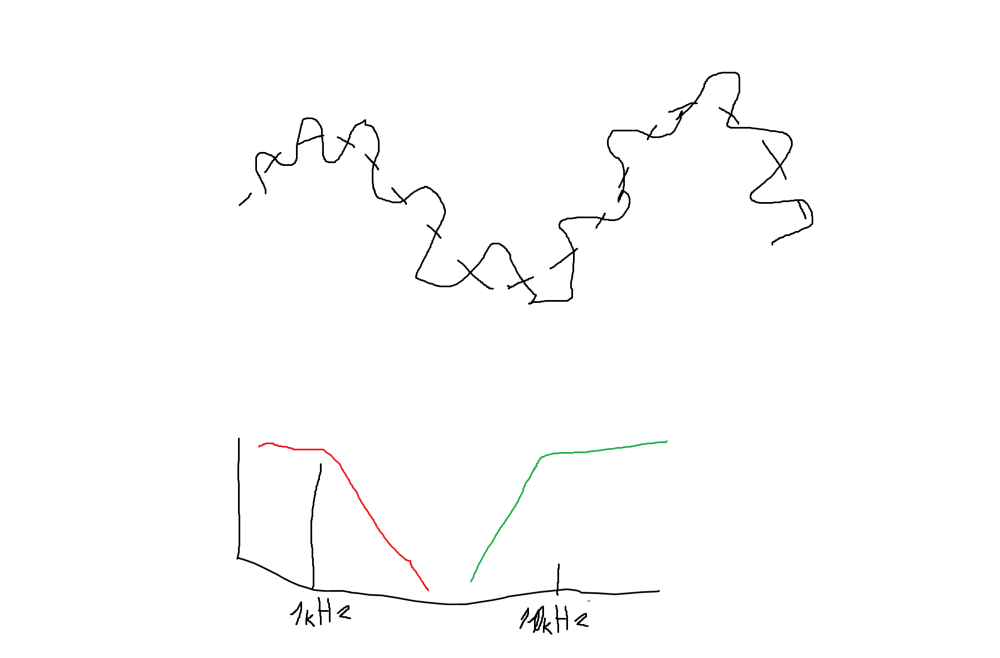
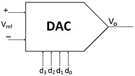
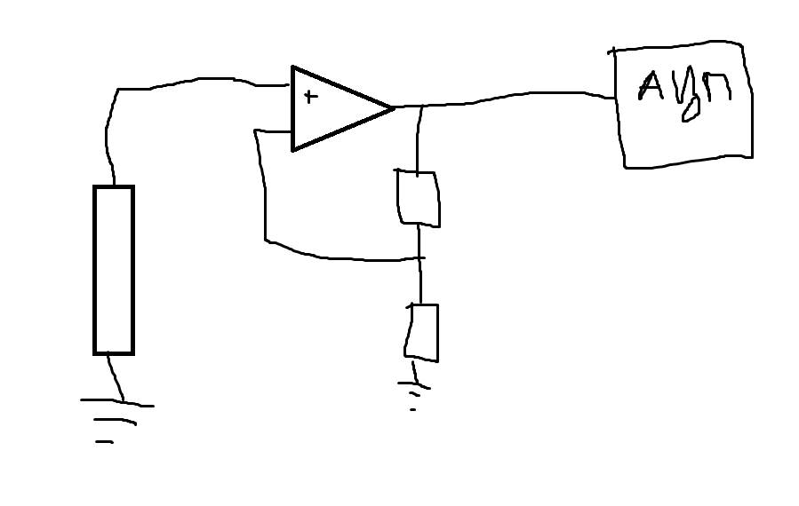

Схеми за събиране на данни

Ако искаме да измерим нещо различно от U/I (неелектрическа величина) добавяме ссензор

S (сензор) - преобразуват от неелектрическа в електрическа


Промените в природата (примерно температурата) се случва плавно - винаги.
За да обработваме този тип (аналогови) сигнали ни трябват аналогови устройства.

Цифровите устройства - изменят се почти внезапно се променя


Имаме сензор, аналогова част и усилвател, който прави сигнала просто по-голяма амплитуда/размах (защото промените са в малък порядък)


Слага се после ***филтър*** 

Когато се взима сигнал то има малък шум. Той не ни носи информация и затова слагаме филтър

Има 4 вида:


1. Нискочестотен филтър
2. Високочестотен филтър
3. Лентов филтър - от до
4. РФ - Режекторен филтър - маха един сигнал и пуска вс друго



Всеки сигнал може да се представи като сума от много честоти

Винаги полезната информация е в ниската честота, а другото което се колебае е високата честота (най-често), която е шум


Чак когато се махне шума има логика от преобразуване и затова се слага АЦП

ЦАП се означава с това:


защото входа е цифров (веднага се променя) а изхода е планве - обратното е за АЦП


Най-накрая се слага CPU(процесорче)


Проблеми при усилвателите:
От правилото за "таваните" когато имаме +5 И -5 а искаме примерно разликата да ни е 100V няма как да постигнем. Оказва се че тия усилватели не издържат на толкова големи напрежения
Затова се добавят два транзистора

Диференциален сигнал - разлика между две напрежения

Диференциални усилвател - ако искаме да направим схема, която измерва разликата между две напрежения - при медицината за QRS (ЕКГ на български) да се мери разликата между електродите които се поставят на тялото


Резисторите трябва да са еднакви в тази схема:


Комплектоват се ако искаме и усилване


Генериране на истински random шум - 


Шум на Johnson - бял шум който се генерира от резистора

```en = sqrt(4*k*T*R)```