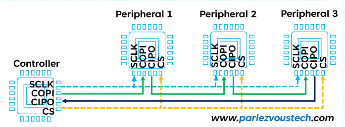

В IoT нещата thing-oвете имат:
PSU - power supply unit
transmiter - комуникация
актулатор - от устройството към средата
сензори - от средата към актулаторите

Импеданс

Как си избираме АЦП:
1. Input range - реални стойсности са от порядъка 5 волта
ако ни трябва различно или взимаме трансформатор (за променливо напрежение) или схема с фиксирана предавателна характеристика
2. брой битове - резолюция -> най-ниската стойности която може да измери - 8 bits
3. бързодействие SPS (sample per second) - 10-100K 
*** Те са или много бързи или много точни - не може и двете ***
4. Interface - изхода как се чете
5. Footprint - разстоянието между пистичките
6. Component grade - диапазон в какви условия ще работи
7. Цена

I2C                 MCU
SCK <----------------
DATA <------------->

SPI
MOSI
MISO
CLCK
SS <--------------

може daisy chain (навръзват се на салам)

Sensor - изменение от околната среда и ги преобразува в сигнал
Могат да се делят на много видове но главно може:
- пасивни - чака и отчита
- активни - издава нещо и тогава чака

И
- аналогови
- цифрови

