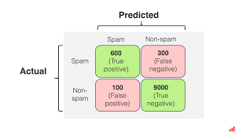

Machine learning:
- Suppervised:
    - Classification (label)
    - Regression (числови стойности)
- Unsupervised:
    - Clustering

Classification:
- Процеса на класификация е процес на разделяне на данните в класове по дадени правила и за тази цел са ни нужни данни
- Тя почти никога не е 100% точна, но е достатъчна за практични цели
Имаме мод, който е set от правила.

Терминология:
Rows - инстанции
Columns - атрибути

Имаме номинални и цифрови атрибути:
- Номинални - категории, които не могат да бъдат подредени (enum - цвят на очите)
- Цифрови - числови стойности

Моделите в практическия случай не са 100% точни и трябва да разберем как бърка, за да знаем.

Точността се мери в процент (accuracy и error rate)
Точност = Брой верни класификации / брой общи класификации

=> Confusion matrix с размерност броя на класовете за иход
Имаме какво е predicted и какво е actual
Диагонала на тази матрица отгоре надолу е верните класификации, а останалите са грешни

Зависимост от случая трябва да видим коя грешка е критична - false positive или false negative

Алгоритми:
- 1R algorithm:
    Set of rules
    Базиран е само върху един атрибут
    Как работи - за всеки атрибут се прави таблица срещу класовете и се избира най-добрият атрибут
    Търсим предоминантната стойност за всеки клас
    По презентацията:

    3 пъти YES и 2 пъти NO
    SLY - Input Output
           Yes   3/5 Yes
           No    3/5 No
    
    Точност: 6/10

    И вече казваме че ако на входа имаме Yes На изхода ще имаме Yes, ако имаме No на входа ще имаме No и ще има 60% точност	

    Ако при binary класификацията имаме 50% точност, това е същото като да хвърлим монета т.е не може <50% точност
    AWT - 3 стойности: 50+, 30-40, 40-50

    Input    Output
    30-40    2/2 No
    40-50    2/3 No
    50+      4/5 Yes
 
    Точност: 8/10

    Това е по-точно така че ще изберем този атрибут, а не горния. Когато обаче ще вземем този само един атрибут, който е най-добрият, то другите атрибути не ги взимаме под предвид и в нашия случай ще ползваме само 25% от данните, което не е добре.

- Decision tree:
  Имаме да направим 1R, гледаме дали е достатъчно точен decision и ако не, правим нов R1 за останалите данни

  В нашия случай от горе имаме че в корена на дървото сме с 2рото (Accuracy 8/10)
  той има:
    - 30-40: 100% (то е достатъчно точно и спираме)
    - 40-50: 66% (то не е достатъчно точно и правим ново дърво)
       - взимаме SLY (servive in the last year)
          - yes: 100% yes
          - no: 100% no

    - 50+: 80% (то не е достатъчно точно и правим ново дърво)
       - взимаме Longest Working Cycle:
            - Above 13 sec: 2/2 Yes
            - Between 11 and 13 sec: 1/1 Yes
            - Below 11 sec: 1/2 No
            Accuracy: 4/5
       - взимаме Average Current:
            - Above 0.6: 2/2 Yes
            - Between 0.6 and 0.5: 1/2 No
            - Below 0.5: 1/1 Yes
            Accuracy: 4/5
        - взимаме SLY:
            - Yes: 2/3 Yes
            - No: 2/2 No
            Accuracy: 4/5

    Взимаме SLY защото имаме най-малко клонове макар и точността да е същата с другата
    
            Но при Yes трябва да зададем още един върпос (още един път да направим R1):
            - взимаме Average Current:
                - Above 0.6: 1/1 Yes
                - Below 0.5: 1/2 Yes
                Accuracy: 2/3
    
    Тъй като обаче това е твърде ниска точност - се връщаме назад и избираме Average Current за втория въпрос...