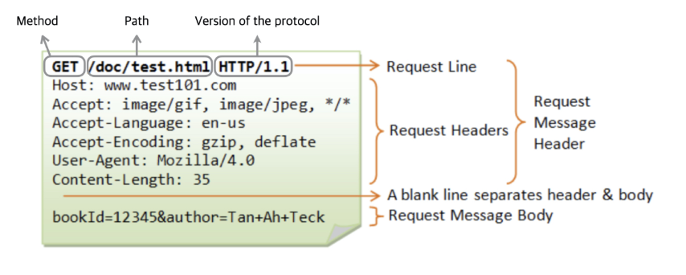
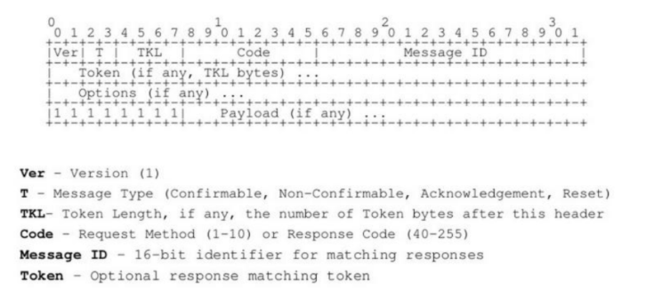

# Layers
### **1. HW (Hardware Layer)**  
**Function:**  
This is the foundational layer where all the physical devices and components operate. It connects the IoT system to the physical world through sensing, actuation, and data collection.  

**Components:**  
- **Sensors and Actuators:**  
   - **Sensors:** Measure environmental parameters such as temperature, pressure, humidity, motion, light, etc.  
   - **Actuators:** Respond to commands (e.g., turning a motor on/off, adjusting a valve).  
- **Microcontrollers/Microprocessors:** Process and control hardware operations (e.g., Arduino, ESP32, Raspberry Pi).  
- **Embedded Devices:** Custom hardware designed for specific IoT purposes.  
- **Gateways:** Facilitate the communication of hardware with networks.  
- **Power Supply:** Battery, solar power, or power grid connections.

---

### **2. Network Layer**  
**Function:**  
The network layer is responsible for **data communication and transmission** between IoT devices, edge devices, and servers. It connects the hardware layer to the upper layers and ensures seamless data flow.  

**Components:**  
- **Communication Technologies:**  
   - **Short-Range:** Wi-Fi, Bluetooth, Zigbee, RFID, NFC.  
   - **Long-Range:** LoRa, NB-IoT, SigFox, 5G, LTE-M.  
   - **Wired:** Ethernet, Powerline Communication (PLC).  
- **Protocols:**  
   - **MQTT (Message Queuing Telemetry Transport):** Lightweight protocol for constrained devices.  
   - **CoAP (Constrained Application Protocol):** Optimized for low-power IoT devices.  
   - **HTTP/HTTPS:** Web-based communication.  
- **Gateways:** Devices that manage communication between sensors and cloud.  

**Purpose:**  
- Provides reliable connectivity.  
- Manages communication protocols and data routing.  
- Ensures data transmission with minimum delay and power consumption.

---

### **3. Data Processing Layer**  
**Function:**  
This layer is responsible for **filtering, processing, and analyzing** the data collected from the hardware layer. It bridges the gap between raw sensor data and meaningful insights.

**Components:**  
- **Edge Processing:** Data is processed locally (near the source) using microcontrollers or edge devices. Examples include Raspberry Pi or NVIDIA Jetson for quick decision-making.  
- **Cloud Processing:** Data is sent to centralized servers or cloud systems like AWS IoT, Microsoft Azure, or Google Cloud for heavy computation and analysis.  
- **Data Analytics Tools:** AI and machine learning algorithms to analyze trends, predict behaviors, or trigger events.  
- **Databases:** Store large-scale IoT data (SQL for structured, NoSQL for unstructured).  

**Purpose:**  
- Process and filter the incoming data.  
- Support real-time and batch analysis.  
- Provide the intelligence for decision-making in IoT systems.

---

### **4. Application Layer**  
**Function:**  
The application layer is where **end-users interact** with the IoT system. It provides tailored interfaces, dashboards, and applications for different use cases.

**Components:**  
- **User Interfaces (UI):** Web dashboards, mobile apps, or APIs to control and monitor IoT devices.  
- **Applications for Specific Use Cases:**  
   - **Smart Homes:** Automation of lighting, security, and appliances.  
   - **Industrial IoT (IIoT):** Predictive maintenance and production monitoring.  
   - **Healthcare:** Remote patient monitoring and wearable devices.  
   - **Smart Cities:** Traffic management, waste management, and energy optimization.  
   - **Agriculture:** Soil moisture monitoring, smart irrigation.  

**Purpose:**  
- Translates processed data into meaningful insights.  
- Allows users to monitor, control, and interact with IoT systems.  
- Delivers actionable insights through data visualization and notifications.

---

### **Summary of the Layers**  
| **Layer**                | **Function**                               | **Key Components**                                        |
|--------------------------|--------------------------------------------|----------------------------------------------------------|
| **HW (Hardware Layer)**  | Data sensing, actuation, and collection    | Sensors, actuators, microcontrollers, power sources      |
| **Network Layer**        | Data transmission and communication       | Wi-Fi, Zigbee, LoRa, MQTT, CoAP, Gateways                |
| **Data Processing Layer**| Data filtering, storage, and analytics     | Edge computing, cloud processing, databases, AI/ML tools |
| **Application Layer**    | End-user interaction and control           | Dashboards, mobile apps, web UIs, domain-specific apps   |

By connecting these layers, IoT systems can function effectively, from sensing physical data to providing actionable insights for decision-making. Each layer plays a critical role in ensuring scalability, efficiency, and reliability.

# PSU

### **Power Supply Unit (PSU) for IoT Devices**

A **Power Supply Unit (PSU)** provides a stable and reliable power source to an IoT device, ensuring its operation without interruptions. It converts raw power (AC or DC) into regulated voltage levels that the device requires.

---

### **1. Requirements for a PSU in IoT**

When designing or selecting a power supply unit for an IoT device, the following requirements should be considered:

- **Input Voltage:** The range of input voltage the PSU can accept (e.g., 220V AC, 12V DC, or battery sources like 3.7V).  
- **Output Voltages:** Stable and regulated output voltages required by the device (e.g., 5V, 3.3V, or multiple outputs for sensors and controllers).  
- **Continuous Current Consumption:** The average current the IoT device consistently draws during normal operation.  
- **Peak Current Consumption:** The maximum current the device requires during short bursts of operation (e.g., wireless transmission or motor activation).  
- **Efficiency/Cooling:** High efficiency is critical to minimize power losses and heat generation, especially for battery-powered systems. Adequate cooling mechanisms (heat sinks or thermal design) are necessary for high-power applications.  
- **Derating/Grade:** Ensure the PSU is designed for operational limits, factoring in temperature derating and industrial/automotive grade standards for reliability.  
- **Insulation:** Proper electrical insulation to ensure safety, especially for line-powered systems connected to 220V AC mains.  
- **Diagnostics:** Include monitoring features like undervoltage, overvoltage, current limits, and thermal protection for fault detection and diagnostics.

---

### **2. Power Sources**

IoT devices can derive power from various sources:

1. **Line Power (AC Power):** 220V/110V AC mains converted to DC. Suitable for fixed installations.  
2. **Battery Power:** Portable devices powered by rechargeable or disposable batteries.  
3. **Energy Harvesting:** Devices that gather energy from environmental sources (solar, thermal, kinetic, RF).  
4. **Combined**

The **PSU** is responsible for supplying the required power to the IoT system. It includes the following components:

- **External Feeders:**  
   - External feeders provide the primary input power to the PSU. This can include:  
     - **AC Power (from the power grid)**  
     - **DC Power (from batteries or power adapters)**  
     - **Renewable energy sources (solar panels, etc.)**  
   - These feeders act as the initial power source for the IoT device.  

- **Energy Storage:**  
   - Energy storage devices, like **batteries** or **supercapacitors**, store energy to ensure continuous operation even during power interruptions.  
   - They provide backup power and support **peak power demands** when the load increases (e.g., during wireless transmission or motor activation).  

- **Power Regulators:**  
   - Power regulators ensure the input voltage is converted and regulated to meet the IoT device's requirements.  
   - These regulators can be:  
     - **LDO (Linear Regulators):** For low-noise, low-current applications.  
     - **Buck/Boost Converters:** For efficient step-down (buck) or step-up (boost) voltage conversion.  
   - The regulators stabilize the voltage and protect the connected components from power variations.  

---

### **3. Line Powered IoT Devices**

- **Definition:** Devices that use a direct connection to the power grid (e.g., 220V AC).  
- **Components:**  
   - AC-DC converters to step down and regulate voltage (e.g., to 5V or 3.3V DC).  
   - Transformers, bridge rectifiers, capacitors, and voltage regulators.  
- **Advantages:** Reliable, continuous power for fixed systems (e.g., smart meters, industrial sensors).  
- **Considerations:** Safety, insulation, surge protection, and voltage regulation.

---

### **4. Battery Powered IoT Devices – What to Consider**

Battery-powered devices are ideal for portable, remote, or wireless IoT systems. Key factors include:

1. **Battery Type:**  
   - **Primary Batteries:** Non-rechargeable (e.g., Alkaline, Lithium Thionyl Chloride).  
   - **Secondary Batteries:** Rechargeable (e.g., Li-ion, Li-Po, NiMH).  

2. **Capacity and Runtime:** Battery life is determined by the energy capacity (mAh) and device current consumption.  

3. **Power Consumption:**  
   - Use low-power components (e.g., sleep modes, optimized firmware).  
   - Reduce transmission intervals for wireless modules.  

4. **Operating Environment:** Batteries must withstand temperature variations and humidity.  

5. **Rechargeability:** Design circuits for energy replenishment (solar, USB charging, etc.).

---

### **5. Energy Harvesters – Sources**

Energy harvesting allows IoT devices to operate without batteries or extend battery life. Common energy harvesting sources include:

- **Solar Power:** Photovoltaic cells convert sunlight into energy.  
   - Suitable for outdoor IoT devices like weather stations or smart agriculture.  
- **Thermal Energy:** Converts temperature differences into power using thermoelectric generators (TEGs).  
   - Useful in industrial processes and body-worn IoT devices.  
- **Vibration/Kinetic Energy:** Converts mechanical movement into power using piezoelectric materials.  
   - Ideal for wearable devices or machinery monitoring sensors.  
- **RF Energy (Wireless):** Converts ambient radio frequency (RF) signals into usable power.  
   - Examples: Wi-Fi, cellular signals, or dedicated RF transmitters.  

**Considerations:**  
- Low power output – requires efficient power management circuits.  
- Energy storage (supercapacitors or rechargeable batteries) for consistent operation.

---

### **6. Voltage Regulators**

Voltage regulators ensure a **steady voltage output** to power IoT devices. They convert input voltage (varying or unregulated) into the desired voltage.

#### **A. Linear Regulators (LDO - Low Dropout Regulators)**  
- **Definition:** A linear regulator drops excess voltage linearly to achieve the required output.  
- **Features:**  
   - Simple design and low noise.  
   - Suitable for low-current applications.  
- **Efficiency:** Low, especially when input voltage is much higher than output. Excess energy is dissipated as heat.  
- **Example ICs:** LM7805 (5V), LM1117 (3.3V).  
- **Use Case:** Devices with stable, low-input voltages and minimal power needs.  

---

#### **B. Switching Regulators – Buck/Boost**  

- **Buck Regulator (Step-Down):**  
   - Converts higher input voltage to a lower output voltage.  
   - High efficiency (85–95%).  
   - Example: 12V → 5V.  
- **Boost Regulator (Step-Up):**  
   - Converts lower input voltage to a higher output voltage.  
   - Example: 3.7V → 5V.  
- **Buck-Boost Regulator:** Combines both functions, allowing input voltage to be higher or lower than the output.  
- **Example ICs:** LM2596 (Buck), MT3608 (Boost).  
- **Use Case:** Battery-powered devices where input voltage varies (e.g., 3.7V Li-ion battery powering a 5V device).  

---

### **7. Regulators – LDO vs Buck**

| **Parameter**           | **LDO (Linear Regulator)**               | **Buck Regulator (Switching)**      |
|-------------------------|------------------------------------------|-------------------------------------|
| **Efficiency**          | Low (energy wasted as heat).            | High (85–95%), energy-efficient.    |
| **Noise**               | Low noise (clean output).               | Higher noise due to switching.      |
| **Complexity**          | Simple and easy to implement.           | More complex with inductors, etc.   |
| **Heat Dissipation**    | High if input voltage >> output voltage.| Minimal heat generation.            |
| **Cost**                | Low cost.                               | Higher cost.                        |
| **Use Case**            | Low-current, low-power applications.    | Battery-powered, high-efficiency needs.|

---

### **Summary**

When powering an IoT device:  
- Use **line-powered PSUs** for fixed installations with reliable grid power.  
- Use **battery-powered systems** for portability, considering capacity and efficiency.  
- Incorporate **energy harvesting** for sustainability in low-power devices.  
- Use **LDO regulators** for low-noise, low-power scenarios.  
- Use **buck/boost regulators** for high-efficiency power conversion in battery-operated devices.

By selecting the right PSU components and regulators, IoT devices can achieve optimal performance, energy efficiency, and reliability.

# **Sensors and Actuators in IoT**

Sensors and actuators are integral parts of IoT systems, providing the means to gather data from the environment (sensors) and take action based on that data (actuators). Here's a detailed explanation of the different types of sensors and actuators.

---

### **1. Sensors**

Sensors are devices that detect physical or environmental changes and convert them into electrical signals for processing.

#### **Types of Sensors:**

- **Analog Sensors:**  
   - **Definition:** These sensors produce a continuous output signal (usually voltage or current) that is **proportional to the measured physical value**.  
   - **Example:** A temperature sensor that outputs a continuous voltage corresponding to the temperature being measured.  
   - **Applications:** Temperature, light, and pressure sensors often provide analog outputs.

- **Digital Sensors:**  
   - **Definition:** These sensors provide discrete output signals, which are often binary (on/off) or in digital format. The data is usually stored in registers for processing.  
   - **Example:** A digital thermometer where the sensor might output a numerical value or "1" for detected motion.  
   - **Applications:** Digital thermometers, motion detectors, and digital humidity sensors.

- **Passive Sensors:**  
   - **Definition:** These sensors do not require an external power source to operate; instead, they rely on the physical phenomena they are measuring to generate the signal.  
   - **Example:** Thermocouples and Light Dependent Resistors (LDR).  
   - **Applications:** Passive sensors are commonly used in temperature and light measurement.

- **Active Sensors:**  
   - **Definition:** These sensors require an external power source to operate. They actively interact with the environment to gather data (e.g., emitting signals and measuring reflections).  
   - **Example:** Ultrasonic sensors and radar sensors.  
   - **Applications:** Active sensors are used in distance measurement, motion detection, and imaging applications.

---

#### **Examples of Specific Sensors:**

- **LDR (Light Dependent Resistor):**  
   - **Function:** LDRs are sensors that change their resistance based on the amount of light falling on them.  
   - **Operation:** When light intensity increases, the resistance decreases, and vice versa.  
   - **Applications:** Light sensors in automatic lighting, streetlights, or photography devices.

- **Ultrasonic Sensor:**  
   - **Speed of Sound:** The speed of sound is 344 meters per second (at 20°C in dry air).  
   - **Function:** These sensors use sound waves to measure distance by emitting a pulse and measuring the time it takes for the echo to return.  
   - **Applications:** Distance measurement, proximity sensors, level monitoring, and object detection in robotics.

- **Reed Switch:**  
   - **Function:** A reed switch consists of two ferromagnetic contacts within a sealed glass tube. When a magnetic field is present, the contacts close, allowing electrical current to pass through.  
   - **Applications:** Door/window sensors in security systems, position sensing, and proximity detection.

- **Inertial Measurement Unit (IMU):**  
   - **Function:** IMUs measure acceleration, angular velocity, and sometimes magnetic field strength using a combination of accelerometers, gyroscopes, and magnetometers.  
   - **Applications:** Used in navigation, motion tracking, robotics, and automotive applications for tracking movement and orientation.

---

### **2. Actuators**

Actuators are devices that convert electrical signals (or other inputs) into physical motion or action. They enable IoT systems to take real-world actions based on sensor data or user commands.

#### **Types of Actuators:**

- **Electrical Motor:**  
   - **Function:** Converts electrical energy into mechanical movement. Electrical motors are used in a variety of applications that require motion.  
   - **Examples:** DC motors, stepper motors, and AC motors.  
   - **Applications:** Robotics, fans, and industrial automation.

- **Hydraulic Cylinder:**  
   - **Function:** A hydraulic actuator uses pressurized fluid (typically oil) to create mechanical movement. The cylinder moves a piston back and forth, converting fluid pressure into linear motion.  
   - **Applications:** Used in construction machinery, automotive systems, and heavy industrial machinery for lifting or pushing actions.

- **Servo:**  
   - **Function:** A servo motor provides precise control of angular position, speed, and acceleration, typically using a feedback mechanism.  
   - **Applications:** Robotics, camera systems, and adjustable antennas.

- **Step Motor (Stepper Motor):**  
   - **Function:** A stepper motor divides a full rotation into a number of equal steps, providing precise control of the position.  
   - **Applications:** 3D printers, CNC machines, and positioning systems.

- **Screwjack:**  
   - **Function:** A screwjack is a mechanical device that uses a screw thread to convert rotational motion into linear motion, typically for lifting heavy loads.  
   - **Applications:** Car jacks, lifting devices, and mechanical systems in manufacturing.

---

#### **Specialized Actuators:**

- **Relay:**  
   - **Function:** A relay is an electrically operated switch that allows a low-power signal to control a higher-power circuit. When an electrical current flows through the coil, it activates the relay switch.  
   - **Applications:** Used to control larger devices, such as motors, lights, and other high-power systems through low-power control circuits.

- **PWM (Pulse Width Modulation) Actuators:**  
   - **Function:** PWM allows control of the power delivered to an actuator by varying the duty cycle of a pulse signal. It is commonly used for controlling the speed of motors, brightness of LEDs, and other devices requiring variable power.  
   - **Applications:** Speed control of fans, motor control, and dimming of lights.

---

### **Summary:**

- **Sensors** are devices that detect changes in the environment and convert them into electrical signals, and can be classified as **analog**, **digital**, **passive**, or **active** depending on their operation and power requirements.
- **Actuators** are devices that convert electrical energy into mechanical motion, enabling IoT systems to take action based on the sensor data. Actuators include **motors**, **servo motors**, **hydraulic cylinders**, **step motors**, and **relays**.
- **PWM** is a useful technique for controlling actuators with variable power input, commonly applied in motor control, lighting, and other systems.

# Microprocessor vs Microcontroller

## MICROPROCESSOR VS MICROCONTROLLER

### Microprocessor (MPU):
- **Definition**: A microprocessor is a general-purpose processing unit that requires external components to function, such as memory, I/O interfaces, and peripherals.
- **Key Characteristics**:
  - Focused on high computational performance.
  - Requires external RAM and storage.
  - Used in devices like PCs, servers, and high-end embedded systems.

### Microcontroller (MCU):
- **Definition**: A microcontroller is a compact integrated circuit that includes a processor, memory (RAM/Flash), and peripherals in one package.
- **Key Characteristics**:
  - Designed for control-oriented tasks.
  - Includes built-in RAM and storage.
  - Low power consumption and cost.
  - They are **constrained**
- **Use Cases**: IoT devices, home automation, automotive control systems, and low-power applications.

**Summary**:
| Feature           | Microprocessor              | Microcontroller             |
|-------------------|-----------------------------|-----------------------------|
| **Focus**         | High computation power      | Control and embedded tasks  |
| **Components**    | External memory required    | Built-in memory and I/O     |
| **Power**         | Higher                      | Lower                       |
| **Cost**          | Expensive                   | Cost-effective              |
| **Examples**      | Intel Core i7, AMD Ryzen    | STM32, Arduino (ATmega)     |

# SOC, SOM, SBC CONSIDERATIONS

### System on Chip (SoC):
- **Definition**: An SoC integrates multiple components—processor, memory, I/O, and sometimes RF modules—on a single chip.
- **Advantages**:
  - Compact and energy-efficient.
  - Ideal for mobile and embedded applications.
- **Examples**: Qualcomm Snapdragon, Apple M1.

### System on Module (SoM):
- **Definition**: A modular version of an SoC, mounted on a small board with additional components like power regulation and external interfaces.
- **Advantages**:
  - Easier integration into designs.
  - Can speed up development and reduce time to market.
- **Examples**: NVIDIA Jetson Nano, Raspberry Pi Compute Module.

### Single Board Computer (SBC):
- **Definition**: A complete computer built on a single circuit board, often including SoC or SoM, RAM, storage, and I/O ports.
- **Advantages**:
  - Ready-to-use platform for development or deployment.
  - Can run full operating systems (e.g., Linux).
- **Examples**: Raspberry Pi, BeagleBone.

**Summary**:
| Feature           | SoC                         | SoM                         | SBC                         |
|-------------------|-----------------------------|-----------------------------|-----------------------------|
| **Integration**   | Highest                     | High                        | Moderate                    |
| **Flexibility**   | Low                         | Medium                      | High                        |
| **Ease of Use**   | Requires custom PCB design  | Modular and customizable    | Plug-and-play               |
| **Cost**          | Low per unit                | Medium                      | High per unit               |

---

## KEY CONSIDERATIONS

### Interfaces:
- **Definition**: Hardware connections for communication between components or devices.
- **Common Types**:
  - **Digital**: UART, SPI, I2C (low-speed control-oriented).
  - **High-Speed**: USB, Ethernet, PCIe (used for fast data transfer).
  - **Analog**: ADC/DAC for sensors and actuators.

### Performance:
- **Factors**:
  - Clock speed (measured in GHz for processors).
  - Number of cores.
  - Ability to handle computational workloads.
- **MPU vs MCU**:
  - MPUs excel in high-performance applications.
  - MCUs are optimized for efficiency in simpler tasks.

### RAM, FLASH:
- **RAM**:
  - Volatile memory for temporary data storage.
  - Critical for running applications.
- **Flash Memory**:
  - Non-volatile storage for program code and data.
  - Embedded MCUs often include both RAM and Flash onboard.

### Grade:
- **Definition**: The environmental or application-specific rating of a component.
- **Types**:
  - **Consumer Grade**: Standard temperature range (-0°C to 70°C).
  - **Industrial Grade**: Wider temperature range (-40°C to 85°C) and higher durability.
  - **Automotive/Aerospace Grade**: Extreme environments with additional reliability testing.

### Power Consumption:
- **MCU**:
  - Low power for battery-operated or energy-sensitive applications.
- **MPU**:
  - Higher power usage, often requiring active cooling.

### Price:
- **MCU**: Typically less expensive, especially for large-scale production.
- **MPU**: Higher cost due to complexity and performance.

### Complexity:
- **MCU**:
  - Simple to design with due to integrated peripherals.
- **MPU**:
  - Complex design process requiring external components like memory and power management ICs (PMICs).

# Computation & Communication Models

## COMPUTATION MODELS

### Device Computing:
- **Real-Time**: Processes data in real-time.
- **Data Source**: Directly connected sensors.
- **Resources**: Constrained resources and limited computing power.

### Edge Computing:
- **Latency**: Reduced delay compared to cloud, though influenced by communication protocols.
- **Data Source**: Aggregates data from multiple sensors.
- **Resources**: Moderately larger computing power than devices.

### Cloud Computing:
- **Latency**: Significant delay due to internet communication.
- **Data Source**: Can handle data from millions of devices.
- **Resources**: Vast computing power to run complex algorithms.

---

## DEVICE VS EDGE VS CLOUD COMPUTING

| Feature                 | Device Computing        | Edge Computing         | Cloud Computing          |
|-------------------------|-------------------------|-------------------------|--------------------------|
| **Real-Time**           | Yes                    | Partial                | No                       |
| **Data Source**         | Single device sensors  | Multiple sensors       | Millions of devices      |
| **Resources**           | Limited                | Moderate               | Extensive                |
| **Delay**               | Minimal                | Low                    | High                     |

---

## COMMUNICATION MODELS

### Types of Communication:
- **D2D**: Device-to-Device.
- **D2E**: Device-to-Edge.
- **D2C**: Device-to-Cloud.

### Communication Patterns:
1. **Request & Response Model**
2. **Publisher/Subscriber Model**
3. **Push-Pull Model**
4. **Exclusive Pair**

---

## REQUEST & RESPONSE MODEL
- **Architecture**: Based on client-server model.
- **Stateless**:
  - The server does not retain client session information.
- **How It Works**:
  1. Client sends a request to the server.
  2. Server processes the request, fetches data or resources.
  3. Server prepares a response and sends it back to the client.

---

## PUBLISHER/SUBSCRIBER MODEL
- **Entities**:
  1. **Publishers**: Sources of data; send data to topics managed by brokers.
  2. **Brokers**: Manage topics, accept data from publishers, and distribute it to consumers.
  3. **Consumers**: Subscribe to topics to receive relevant data.
- **Key Features**:
  - Publishers do not know the consumers.
  - Brokers ensure appropriate data delivery to subscribers.
  - Efficient for scalable systems with dynamic participants.

## PUSH-PULL MODEL
- **Components**:
  - Data publishers, data consumers, and data queues.
- **Key Features**:
  - Publishers and Consumers are not aware of each other.
  - Publishers push messages/data into the queue, and consumers pull the data out of the queue.
  - The queue acts as a buffer to handle rate mismatches between publishers and consumers.
- **Benefits**:
  - Decouples messaging between producers and consumers.
  - Queues help buffer data, ensuring smooth operation when push and pull rates differ.

---

## EXCLUSIVE PAIR
- **Description**:
  - A bi-directional, full-duplex communication model between client and server.
  - The connection remains open until the client explicitly requests closure.
- **Key Features**:
  - The server maintains a record of all open connections.
  - This is a stateful model, as the server is aware of active connections.

---

# CLIENT-SERVER COAP (Constrained Application Protocol)

## REST (Representational State Transfer)
- **Principles**:
  - Resource-based architecture.
  - Stateless communication.
  - Client-Server based interactions.
  - Cacheable responses.
  - Uniform Interface for interaction.

---

## HTTP (HyperText Transfer Protocol)
- The HTTP protocol is used extensively in RESTful applications.
- 

---

## COAP (Constrained Application Protocol)
### Overview
- Specialized web protocol for constrained devices in IoT.
- **Communication Model**: Client-Server.
- **Transport Layer**: UDP-based (also supports SMS).
- **Features**:
  - Supports HTTP-like verbs: `GET`, `PUT`, `POST`, `DELETE`.
  - Lightweight HTTP-like header.
  - Uses `URI` (Uniform Resource Identifier) for resource addressing.
  - Supports resource discovery and asynchronous subscriptions.
  - Compact 4-byte header for efficiency.
  - Multicast and one-to-one communication supported.
  - DTLS encryption for security.

---

## COAP – MESSAGE FORMAT

### Key Components of the COAP Message Format:
1. **Version (2 bits)**: Identifies the CoAP version in use.
2. **Type (2 bits)**:
   - **Confirmable (CON)**: Requires acknowledgment.
   - **Non-confirmable (NON)**: Does not require acknowledgment.
   - **Acknowledgment (ACK)**: Response to a confirmable message.
   - **Reset (RST)**: Indicates an error or that a message is not understood.

3. **Token Length (4 bits)**: Specifies the length of the token (0 to 8 bytes).
4. **Code (8 bits)**:
   - Split into two parts: `3-bit class` and `5-bit detail`.
   - Defines the method (e.g., GET, POST) or response code (e.g., 2.05 for content).
5. **Message ID (16 bits)**: Unique identifier for matching messages.
6. **Token (0 to 8 bytes)**: Used for request-response pairing.

---

## COAP – REQUEST EXAMPLE
- CoAP requests include the method (e.g., GET) and the target URI. Responses carry the status code and optional payload.

---

## COAP – PACKET LOSS
- CoAP uses retransmission mechanisms for confirmable messages to handle packet loss.
- Timeouts and exponential backoff are implemented for reliability.

---

## COAP – PACKET FORMAT
- Includes header, token, options, and payload sections.
- Compact design ensures minimal overhead for IoT devices.

---

## COAP – SUBSCRIPTION
- Supports asynchronous observation of resources.
- Clients can subscribe to resource updates using the observe option.
- Notifications are sent whenever the resource state changes.

---

## COAP – BLOCK TRANSFER
- Used for transferring large payloads in smaller chunks.
- Supports fragmentation and reassembly for constrained devices.

---

# MQTT (Message Queuing Telemetry Transport)

## MQTT OVERVIEW
- **Purpose**: Specialized web protocol for constrained IoT devices.
- **Communication Model**: Publisher-Subscriber.
- **Protocol**: TCP-based.
- **Features**:
  - Minimal overhead.
  - Reliable communication over unreliable channels.
  - Binary format for efficiency.
  - Bidirectional communication.
  - Data agnostic.
  - Highly scalable.
  - TLS encryption for secure communication.
  - Keep-alive mechanism ensures consistent connectivity.

---

## MQTT CLIENT/BROKER CONNECTION
- **Process**:
  1. Client sends a `CONNECT` packet to the server.
   - **Contains**:
      - clientID
      - cleanSession
  2. Server responds with a `CONNACK` packet to establish the connection.
   - **Contains**:
      - sessionPresent (bool)
      - return code
- **Underlying Protocol**: TCP.

### MQTT PACKETS
1. **Client/Broker Connection**:
   - `CONNECT`: Initiates a connection to the broker.
   - `CONNACK`: Acknowledges connection establishment.

2. **MQTT Publish**:
   - `PUBLISH`: Sends data from a publisher to the broker.
    - **Contains**:
      - packetId
      - topicName
      - **qos**
      - retainFlag
      - payload (the data)
      - dupFlag

3. **MQTT Subscribe**:
   - `SUBSCRIBE`: A client subscribes to specific topics.
    - **Contains**:
      - packetId
      - {qos1, topic1...}
   - `SUBACK`: Acknowledges the subscription.
    - **Contains**:
      - packetId
      - {return code1...}

4. **MQTT Unsubscribe**:
   - `UNSUBSCRIBE`: A client unsubscribes from specific topics.
    - **Contains**:
      - packetId
      - {topic1...}
   - `UNSUBACK`: Acknowledges the unsubscription.
    - **Contains**:
      - packetId
---

## MQTT TOPICS
- **Definition**: Topics are UTF-8 strings used to filter messages for subscribers.
- **Structure**:
  - Hierarchical.
  - Levels separated by `/`.
  - Supports wildcards.

### MQTT TOPIC WILDCARDS
1. **`+` Wildcard**:
   - Represents a single level in the hierarchy.
   - Example: `home/+/temperature` matches `home/livingroom/temperature`.

2. **`#` Wildcard**:
   - Represents multiple levels in the hierarchy.
   - Example: `home/#` matches `home/livingroom/temperature` and `home/kitchen/humidity`.

### MQTT TOPIC LEVELS
- Example Hierarchy:
  - `home/kitchen/temperature`
  - `home/livingroom/humidity`
  - `office/meetingroom/light`

---

## MQTT QOS (Quality of Service)
- **Purpose**: Ensures reliable communication between parties.
- **Levels**:
  1. **QoS 0**: At most one delivery (no guarantee).
  2. **QoS 1**: At least one delivery (duplicates possible).
  3. **QoS 2**: Exactly one delivery (highest reliability).

---

## MQTT CLEAN/PERSISTENT SESSION
### Types of Sessions:
1. **Clean Session**:
   - All client data is deleted after disconnection.

2. **Persistent Session**:
   - The following data is stored after disconnection:
     - `clientID`.
     - Subscriptions.
     - Unacknowledged QoS messages.
     - Queued messages.

---

## MQTT RETAINED MESSAGES
- **Definition**: The broker stores the topic's last known value.
- **Use Case**: Ensures that new subscribers immediately receive the last retained value.
- **Purpose**: Useful when the initial state is required.

---

## MQTT LAST WILL AND TESTAMENT
- **Purpose**: Used to handle ungraceful disconnections.
- **Ungraceful Disconnect Causes**:
  - No communication within the keep-alive period.
  - I/O error or network failure.
  - No `DISCONNECT` packet sent before closing the connection.

The broker uses the Last Will message to notify other clients about the disconnect.

# Communication Protocols (Wireless & Wired)

## WIRED COMMUNICATION PROTOCOLS

### Why Choose Wired?
- **Existing Infrastructure**: Often pre-installed in many environments.
- **Lower Price**: Typically more cost-effective than wireless solutions.
- **Higher Reliability**: Less interference and stable connections.
- **Power Optimization**: Easier to optimize for low power consumption.

### Ethernet
- **Advantages**:
  - Widespread usage.
  - High speed.
  - Cost-effective.
  - Power over Ethernet (PoE) capability.
- **Disadvantages**:
  - Limited to short-range applications.
  - Complex infrastructure as node counts increase.
  - Requires external devices like switches or hubs.

### RS485
- **Advantages**:
  - Cost-effective.
  - Supports long distances over copper cables.
  - Simple infrastructure.
- **Disadvantages**:
  - Slower speeds compared to Ethernet.
  - Primarily used in industrial applications.

---

## WIRELESS COMMUNICATION PROTOCOLS

### AREA NETWORKS
- **WAN (Wide Area Network)**: Covers large geographic areas.
- **MAN (Metropolitan Area Network)**: Focused on city-level coverage.
- **LAN (Local Area Network)**: Typically spans a building or campus.
- **PAN (Personal Area Network)**: Very short-range, often for individual devices.

### Wi-Fi
- **Advantages**:
  - Widespread; existing infrastructure is often available.
  - High bandwidth (10s–100s Mbps).
  - Medium range; ideal for LAN applications.
  - Cost-effective with no ongoing "data" charges.
- **Disadvantages**:
  - High power consumption.
  - Limited mesh topology support.
  - Range and number of connected devices depend on router capabilities.

### Bluetooth Low Energy (BLE)
- **Advantages**:
  - Widespread; integrated into most smartphones.
  - Medium bandwidth (~1 Mbps).
  - Low power consumption.
  - Very low cost with no "data" charges.
- **Disadvantages**:
  - Limited range (tens of meters).
  - Limited number of connected devices.
  - Requires external gateway for internet access.

#### BLE Topologies
- **Star**: Most commonly used.
- **Mesh**: Supported in Bluetooth Mesh but not widely adopted.
- **Tree**: Limited use cases and support.

### Zigbee
- **Advantages**:
  - Mesh topology supported out of the box.
  - Medium range.
  - Very low cost.
  - Supports over 10,000 connected devices.
  - No ongoing "data" charges.
- **Disadvantages**:
  - Not widely adopted.
  - Router and coordinator nodes cannot sleep.
  - Low bandwidth (hundreds of kbps).
  - Requires an external gateway for internet access.

### 6LoWPAN
- **Overview**:
  - IPv6 over Low-Power Wireless Personal Area Networks.
  - Commonly used in IoT for resource-constrained devices.
- **Advantages**:
  - Supports robust and scalable mesh networks.
  - Leaf nodes can sleep for extended periods.
  - IPv6 protocol enables direct cloud routing.
  - Based on IEEE 802.15.4.
- **Disadvantages**:
  - Low bandwidth (100 kbps).
  - Limited security and interference immunity.

### Cellular (LTE/4G/5G)
- **Advantages**:
  - High bandwidth.
  - Wide range (kilometers).
  - Widespread infrastructure.
- **Disadvantages**:
  - High power consumption.
  - Expensive.
  - Involves ongoing "data" charges.
  - Dependent on external infrastructure.

### LoRa/LoRaWAN
- **Advantages**:
  - Long range (kilometers).
  - Low power consumption.
  - Infrastructure investment in EU countries.
- **Disadvantages**:
  - Extremely low bandwidth (10s–100s bps).
  - Medium cost.
  - Potential "data" charges and infrastructure dependency.
  - Requires external gateway for internet access.

#### LoRaWAN Architecture
LoRaWAN utilizes a star-of-stars topology where end devices communicate with gateways that forward messages to a central network server. This architecture supports large-scale deployments.

## WHEN TO USE WHAT?

| Protocol       | Speed            | Range            | Power Consumption | Price         | Spread        |
|----------------|------------------|------------------|--------------------|---------------|---------------|
| Ethernet       | High (Gbps)      | Short            | Low                | Low           | High          |
| RS485          | Low              | Long             | Low                | Very Low      | Low           |
| Wi-Fi          | Medium-High      | Medium           | High               | Low           | High          |
| BLE            | Low (~1 Mbps)    | Short            | Very Low           | Very Low      | High          |
| Zigbee         | Low              | Medium           | Low                | Very Low      | Medium        |
| 6LoWPAN        | Low              | Medium           | Very Low           | Low           | Medium        |
| Cellular (4G/5G)| Very High        | Very Long        | High               | High          | High          |
| LoRa/LoRaWAN   | Very Low         | Very Long        | Very Low           | Medium        | Medium        |

# More info
For the following topics check the presentations for more info:
- CoAP
- MQTT
- MCU (16th slide)
- PSU