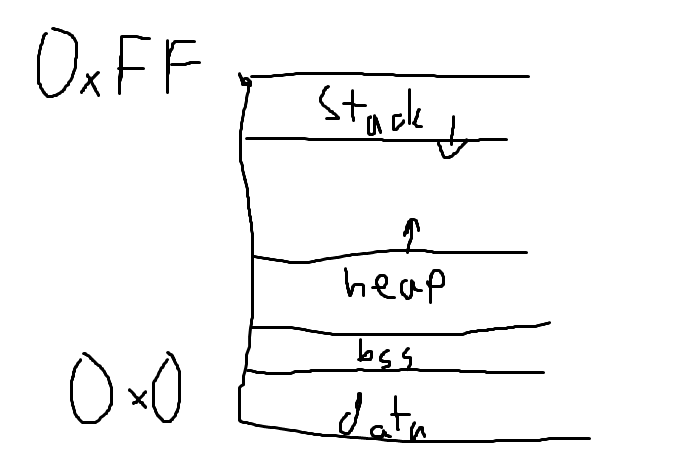
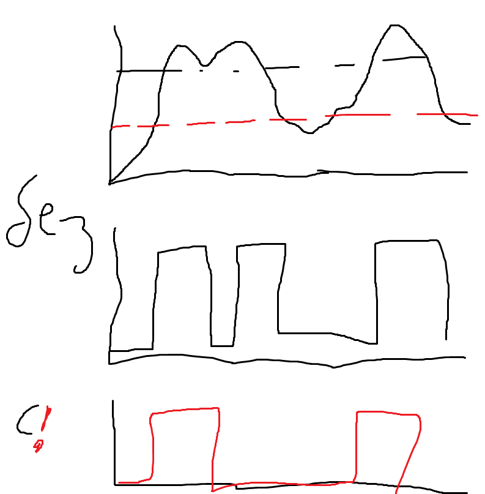
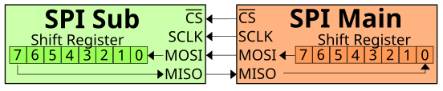
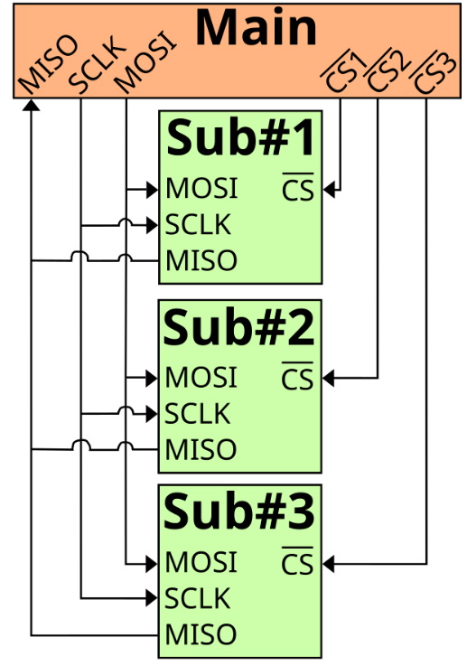
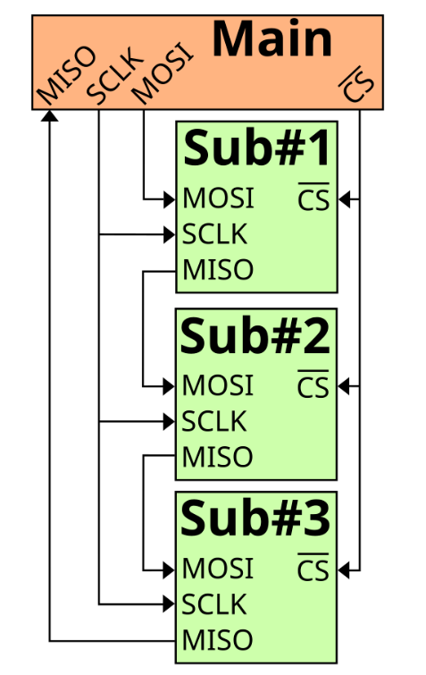
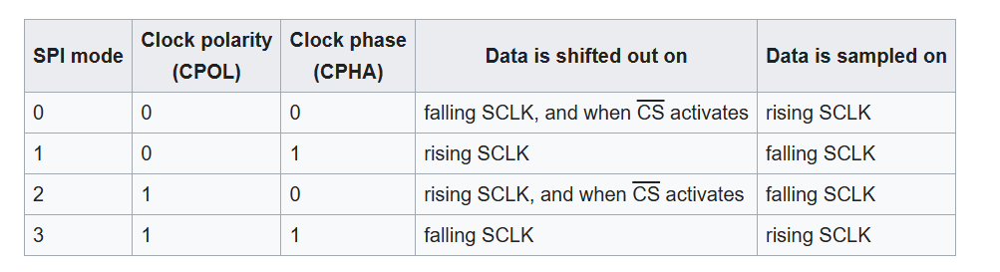
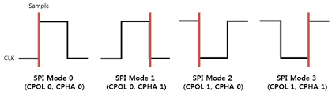
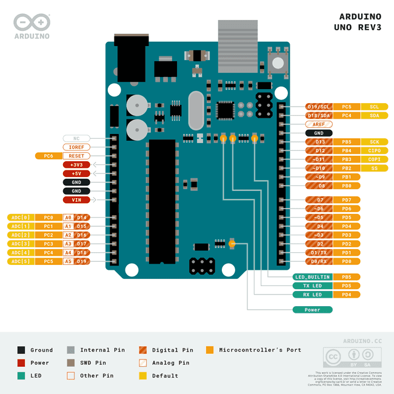

# Embedded System (Вградена система)

Устройство, което съдържа микроконтролер и е специализирано за извършване на специфични задачи. Пример за вградени системи включва: микровълнови фурни, роботи, автомобилни системи и др.

## Микроконтролер vs Микропроцесор

| **Критерий**            | **Микроконтролер (MCU)** | **Микропроцесор (CPU)** | **Обяснение**                                                                                   |
|-------------------------|--------------------------|--------------------------|-------------------------------------------------------------------------------------------------|
| **Изчислителен ресурс**  | Малък                    | Голям                    | MCU имат ограничени изчислителни възможности, докато CPU са проектирани за висока производителност.|
| **Брой транзистори**     | Малко                    | Много                    | MCU имат по-малко транзистори за по-ниска сложност и по-ниска консумация на енергия. CPU имат повече транзистори за по-голяма изчислителна мощност. |
| **Вградена RAM**         | Да                       | Не* (има cache)           | Микроконтролерите имат вградена RAM за основни операции, докато CPU обикновено използват външна RAM, допълнена с кеш. |
| **Вградена ROM**         | Да*                      | Не*                      | MCU имат вграден ROM за съхранение на инструкции, докато CPU разчитат на външна памет за съхранение на програмен код. |
| **Виртуална памет**      | Не*                      | Да                       | CPU поддържат виртуална памет, което им позволява да използват по-големи количества оперативна памет. |
| **Периферни модули**     | Много                    | Малко                    | MCU имат вградени периферни модули като таймери, ADC, и PWM, докато CPU използват външни устройства за тези функции. |

\* Има някои изключения

### Примери:

- **Микроконтролер (MCU):** Arduino, ESP32, STM32
- **Микропроцесор (CPU):** Intel Core i7, AMD Ryzen, ARM Cortex-A

## Как се изчислява колко бита е системата?

За да определим колко бита е дадена система, можем да разгледаме ширината на шината, използвана от процесора. Например:

- **8-битова система:** Микроконтролерът обработва 8 бита наведнъж (например AVR микроконтролери).
- **16-битова система:** Обработва 16 бита наведнъж (например MSP430).
- **32-битова система:** Обработва 32 бита наведнъж (например STM32).

## Тактова честота и изпълнение

- **Такт** - Това е една единична стъпка в работата на процесора, определяна от неговата тактова честота (честотата на осцилатора). Например 1 GHz означава 1 милиард такта в секунда.
- **АЛУ (Аритметико-логическо устройство):** То обработва зададените битове във всеки такт. Пример: 8-битова АЛУ може да обработва 8 бита за един такт.
  
  Например, ако процесорът е 8-битов и има тактова честота от 16 MHz, това означава, че той може да извършва 16 милиона операции за секунда, като всяка операция обработва 8 бита.

## Pipeline (Конвейер)

**Конвейерът** е техника за подобряване на производителността, като позволява едновременното изпълнение на различни стъпки от обработката на инструкциите. При тази техника инструкциите са разделени на няколко етапа (напр. извличане на инструкция, декодиране, изпълнение и запис), които се изпълняват успоредно. Това увеличава скоростта на изпълнение на програмата.

## Архитектури на памет

### Архитектура на фон Нойман

- **Общо описание:** Данните и инструкциите се съхраняват в една и съща памет. Процесорът извлича както данните, така и инструкциите от една и съща шина.
- **Предимства:** Определена простота в дизайна.
- **Недостатъци:** Възниква т.нар. "bottleneck" (тясно място), където процесорът може да бъде забавен, защото може да чете или инструкции, или данни в даден момент, но не и двете едновременно.

### Харвардска архитектура

- **Общо описание:** Паметта за инструкции и паметта за данни са отделни и се използват различни шини за достъп до тях.
- **Предимства:** Процесорът може да чете инструкции и данни едновременно, което подобрява производителността.
- **Недостатъци:** По-сложен дизайн и може да изисква повече памет.

### Пример за харвардска архитектура:
- **Микроконтролерът** STM32 използва харвардска архитектура, при която инструкциите и данните са отделени и се достъпват поотделно.


## Platformio
- https://docs.platformio.org/en/latest/integration/ide/vscode.html#ide-vscode-toolbar


## Presentation
- https://gitlab.com/tues-embedded/vmks-presentations


<br><br><br>


# Документация за Паметта и Работа с Указатели в C

## Описание

Тази документация обяснява основните концепции за паметови сегменти, битови операции и работата с указатели при 16-битова адресна шина. Целта е да предостави полезна и структурирана информация за начина, по който данните и кодът се съхраняват и манипулират в C.

## Съдържание
1. [Void Указател и Размер на Паметта](#void-указател-и-размер-на-паметта)
2. [Сегменти на Паметта](#сегменти-на-паметта)
   - [Data сегмент](#data-сегмент)
   - [Heap](#heap)
   - [Stack](#stack)
   - [BSS (Block Started by Symbol)](#bss-block-started-by-symbol)
3. [Архитектурни Зависимости](#архитектурни-зависимости)
4. [Адресно Пространство на RAM](#адресно-пространство-на-ram)
5. [Периферни Блокове и Тригер на Шмит](#периферни-блокове-и-тригер-на-шмит)
6. [Битови Операции и Използване на Битове](#битови-операции-и-използване-на-битове)
7. [Stack Canary](#stack-canary)

---

### Void Указател и Размер на Паметта

- **Void указател**: Указател с тип `void*` е указател, който не сочи към конкретен тип данни. Това позволява използването му за посочване към различни типове данни. Важно е обаче размерът на `void*` указателя да бъде достатъчен, за да покрие цялата ширина на адресната шина.
- **16-битова адресна шина**: Адресната шина е с размер 16 бита, което означава, че указателят също трябва да бъде поне 16-битов, за да адресира всички възможни адреси в паметта.

### Сегменти на Паметта

#### Data Сегмент
- **Data сегмент**: Съдържа глобални и статични локални променливи с ненулева начална стойност. Те се инициализират преди стартирането на програмата и остават в `data` сегмента по време на изпълнението.
- **Адреси**: Разполага се на най-ниските адреси в паметта.

#### Heap
- **Heap**: Динамично заделената памет в програма. Използва се за данни, чиито размер и време на създаване не са известни предварително, като такива заделени с `malloc` или `calloc`. Паметта в `heap` трябва ръчно да бъде освобождавана с `free`.

#### Stack
- **Stack**: Работен сегмент, използван за съхранение на временни данни, включително:
  1. **Локални променливи**: Променливи, дефинирани в дадена функция и достъпни само в нея.
  2. **Return стойности**: Ако стойностите на връщане са твърде големи за регистрите, те се съхраняват временно в стека.
  3. **Аргументи на функции**: Аргументите могат да се предават в стека, ако не могат да бъдат директно съхранени в регистрите.
  4. **Return адрес**: Адресът, на който трябва да се върне програмата след изпълнението на функцията.
  5. **Междинни стойности и регистри**: Междинни резултати, които трябва да се запазят при извикване на други функции.

> **Важно**: Стекът обикновено се разполага в "по-горните" адреси на паметта и работи надолу – когато се заделя нова памет за променливи, той се "спуска надолу", а когато се освобождава памет, се "издига нагоре".

#### BSS (Block Started by Symbol)
- **BSS** сегмент: Съдържа глобални и статични локални променливи с **нулева начална стойност**. BSS сегментът е специален, защото за него не се заделя реална физическа памет, а само се отбелязва необходимия размер в таблицата на символите.

---

### Архитектурни Зависимости

- **Константни променливи**: Зависи от архитектурата дали константите ще се съхраняват в `data`, `bss` сегмента или в отделен сегмент с права само за четене.
- **Макроси**: Когато се дефинират константи с `#define` (макроси), те може да не изискват реална памет в RAM, защото техните стойности се вграждат директно в кода.

---

### Адресно Пространство на RAM

В адресното пространство на RAM може да има и други памети, които се използват за различни цели:
- **EEPROM**: Нестабилна памет, подходяща за съхранение на малки количества данни, които трябва да се запазват дори при изключване на захранването.
- **Регистри на периферните устройства**: Често са достъпни в специфични адресни диапазони и служат за конфигурация и управление на външни модули.



---

### Периферни Блокове и Тригер на Шмит

- **GPIO** (General Purpose Input/Output): Периферен блок за вход/изход с общо предназначение. Може да бъде конфигуриран за четене или писане на данни чрез специфични регистри.
- **Тригер на Шмит**: Осигурява хистерезис за цифрови сигнали – когато входният сигнал премине горна гранична стойност, тригерът приема стойност "1" и остава такъв, докато сигналът не падне под долната граница.



#### Порт
- **Порт**: Група от пинове, които могат да се конфигурират като входни или изходни. Конфигурацията на даден пин се определя чрез специални битови операции.

---

### Битови Операции и Използване на Битове

Основни оператори за работа с битове:
- **И** (`&`) – побитово И.
- **ИЛИ** (`|`) – побитово ИЛИ.
- **НЕ** (`~`) – побитово НЕ.
- **XOR** (`^`) – побитово изключващо ИЛИ.

Операции за сдвижване:
- **Ляво сдвижване** (`<<`) – използва се за побитово изместване наляво.
- **Дясно сдвижване** (`>>`) – използва се за побитово изместване надясно.

Примери:
- **Вдигане на определен бит**:
  ```c
  a = a | (1 << 5);   // Вдигане на 5-ти бит във високо ниво
  a |= 1 << 5;
  ```
- **Нулиране на определен бит**:
  ```c
  a &= ~(1 << 5);      // Нулиране на 5-ти бит
  ```
- **Проверка на бит**:
  ```c
  if (a & (1 << 5)) {
      // Бит 5 е вдигнат
  }
  ```

---

### Stack Canary

- **Stack Canary**: Това е техника за защита на стека от презаписване, което може да възникне при препълване на буфера. Stack Canary добавя специални байтове (наречени "канарчета") преди адреса на върнатия указател. Ако канарчетата бъдат модифицирани (например при препълване на буфера), това сигнализира, че стекът е бил презаписан, което позволява на системата да прекрати програмата преди настъпване на по-сериозни последствия.


# Прекъсвания и управление на ядрото

## Прекъсвания

Прекъсванията (interrupts) са механизъм на хардуерно ниво, който позволява на процесора да прекъсне текущото си изпълнение на програма и да премине към обработка на по-важна задача (например, отговор на вход от периферно устройство).

### Проблеми с оптимизация от компилатора

Компилаторът обикновено се стреми да оптимизира кода, като променя стойността на променливите, за да направи изпълнението по-бързо. Това обаче може да доведе до проблеми, когато работим с прекъсвания. Ако променлива, която се използва в контекста на прекъсване, се промени по време на прекъсване, компилаторът може да не види това изменение, ако е извършена оптимизация.

### Как да предотвратим оптимизацията

За да се избегне оптимизацията от страна на компилатора при работа с променливи, които могат да се променят извън контрол на програмата (например, по време на прекъсване), използваме ключовата дума `volatile`.

**Пример:**

```c
volatile int flag = 0; // Променливата не бива да се оптимизира от компилатора

void interrupt_handler() {
    flag = 1; // Променяме стойността на flag при прекъсване
}

void main() {
    while (1) {
        if (flag) {
            // Обработка след прекъсване
            flag = 0;
        }
    }
}
```

Тук променливата `flag` е маркирана като `volatile`, което означава, че компилаторът няма да прави оптимизации върху нея и ще осигури правилното й обновяване, когато се промени в контекста на прекъсване.

### Прекъсвания в привилигирован режим

Прекъсванията обикновено се изпълняват в привилигирован режим (kernel mode), който позволява директен достъп до хардуерни ресурси и системни функции. Това е необходимо за да се осигури правилното и безопасно изпълнение на критични операции, свързани с периферни устройства и други хардуерни компоненти.


# Интерфейсите могат да се разделят на:
- паралелен
- сериен

На пръв поглед серийния трябва да е по-бавен (ако са на една честота)


На ниски честоти си е всичко точно
На високи обачe GHz - може да има забавяния (макар и да се праща едновременно) - средния проводник  е най-къс и пристига най-рано
Очевидно решението е да ги направим по-дълги (с завъртулки). Това закъснение обаче се определя от импеданса (което се влияе от всичко)

По серийния може да пращаме колкото искаме бързо на каквато и да е честота, защото закъснението не влияе толкова

Лошото е че ако загубим 1 бит от серийния интерфест трябва да се прати целия пакет наново

Има и други:
- "хибридни" (USB 3, HDMI, Thunderbolt)


# Биват и:
- синхронни - сигнал за данни + сигнал за тактова честота (сигнал за кога трябва да четем)
- асинхронни - сигнала за тактова честота не се праща отделно/директно а е кодиран в сигнала за данни и оттам може да се извелче


При UART тактовата честота е еднаква при приемника и предавателя ноо трябва да се синхронизират

Enetrnet - асинхронен сериен

# Има и:
- peer to peer - равнопоставени 
- master slave - едното оправлява 

# Последното:
- цифрови (нооо това не означава че се праща двоично)
- аналогови


Baud rate - Колко символа се пращат - всеки символ може да праща 1 или 2 бита (пример с wifi пример)


Проверки за грешка:
- проверка по четност - колко единици са пратени и се добавя един бит; нечетен брой сбъркани битове НЯКЪДЕ
- кодове на хеминг


Full duplex - и да приема и предава
Half duplex - или приема или предава
Simplex - може САМО едно от двете


7 segment

Два вида 
- общ анод 
- общ катод


driver lcd 

имаме периферен интрефейс (8/4 битов)

имаме декодер с който му казваме какво прави

няколко памети
- display data ram - текст който да се изобрази на екрана
- charachter genetaror rom - tavlica s bitowe za wseki simwol - има look up таблица
- character generator ram - може ние да добавим симвооли съответно за да светне
- премесващи registers за управление на изходните регистри, които управляват lcd матрицата
- 


При I2C имаме Адресен дешифратор - 

Serial Perifical Interface
- цифров
- синхронен
- сериен 

като I2C - master slave архитектура

Може да се реализира с много по-малко компоненти на хардуерно ниво


Full duplex - не само можем да пращаме в двете посоки а сме ДЛЪЖНИ да го правим 
ако искаме само да четем и нямаме какво да пишем - пращаме нули но е  задължително да има нещо


Нямаме адресация - един сигнал към всяко отделно устройство който да активира - SS, SE 


4 signals
- CS/SS - индивидуален за всяко подчитено устройство
- SCLK - както при I2C - тактов сигнал
- MOSI - еднопосочен, master output slave input
- MISO - еднопосочен, master input slave output


Има няколко схеми на свързване

Входния сигнал отива в единия край на shift register, а другия край - отива на изхода
 


Начин на свързване - едноименните сигнали си се свързват както са. Ползва се главно за памети (може и Quad spi). Това е ако е за едно към едно.
ППЦ се ползва за кратки разстояния (като I2C), но е по-бърз като скростта се задава от master-a с тактовата честота



Това е при няколко подчинени устройства 


втори начин:


Това се ползва главно като са еднакви устройствата и го правим ако datasheet-a го казва изрично че го поддържа. Логиката е подобна на тази за светодиодните ленти 

Като го Init-ваме имаме няколко настройки за задаване:


1. поляритет на сигнала - дали е инвертиран или не
2. фаза на тактовия сигнал - при кой фронт четем данните



По подразбиране имаме CS - разбираме го от pinout диаграмата, където пише SS
 
10ти по подразбиране и ако ни трябват още може да си добавим


Bit rate и baud rate-а съвпадат, (защото е 0 и 1)
MSB (most significant bit)

```SPI.beginTransaction(SPISettings(14000000, MSBFIRST, SPI_MODE0));```

Ръчно трябва да го активираме:
digitalWrite(CS_PIN, LOW);  //HIGH ако е неинвертирано
И така пишем/четем
- receivedVal = SPI.transfer(val)
- receivedVal16 = SPI.transfer16(val16) # същото ма за uint_16
- SPI.transfer(buffer, size) - праща един байт и пише на същия
digitalWrite(CS_PIN, HIGH); //правим го неактивен
SPI.endTransaction()

горе долу вс го има тука - https://docs.arduino.cc/language-reference/en/functions/communication/SPI/


ARM архитектура

Разликата между CISC И RISC
cisk - complex instruction set computer
risc - reduced instruction set computer


ark Cortex
- A series - applications CPUs focused on the execution of complex OS and user applications
- R series - deeply embedded processors focused on real-time enviorments
- M series - microcontroller cores focused on very cost sensitive deterministic interrupt driven env


memory protection unti - по просто, дава само изолация на ram паметта  
memory managment unit


LDR - load register, копира от паметта в регистъра
SDR - store register, копира от регистъра в паметта

STRB - store byte - копира 1 байт
```[R5]``` - дереферира окаазтел
```[R5, R6]``` - събира R5 и R6 и дереферира


# Преговор
Какво имаме в едно ядро
ALU -aritmetico logical unit
регистри - 12 общи регистри
RAM памет - не е свързана директно с ALU


Взимаме от памметта и слагаме в регистъра вършим работа с тях и ги връщаме обратно в паметта

Възможно е някоя проемлива да е в регистъра и да не е в паметта

От general purpose регистрите са разделени на low и high. Ако искаме да върнем някоя стойност (return от функция) ползваме R0.
Когато викаме функция ползваме първите 4 регистъра за аргументите на функцията.

1 специален - stack pointer - сочи първия свободен елемент на stack-a и с push и pop се увеличава и намалява.

LR - link register - когато викаме функция се запазва адреса на следващата инструкция

Program counter - къде сме в програмата - адреса на следващата инструкция която ще се прочете

PSR - program status register - флагове за грешки и други неща а ако сме в прекъсване имаме номера на прекъсването

control register - за промяна на режима на работа на ядрото

Памет:
Два вида архитектури - Harvard и von Neumann (според ядрото)
Harvard - разделена памет за инструкции и данни
von Neumann - една памет за инструкции и данни

Системна матрица - къде се намират периферните устройства

MOV - премества стойност от едно място на друго (копиране)
B - branch - премества програмния брояч на друго място
BL - branch and link - премества програмния брояч на друго място и запазва адреса на следващата инструкция  (когато викаме функция)
ADD - събира две стойности
SUB - изважда две стойности - R0, R0, #1 - изважда 1 от R0 и записва в R0
BX LR - връща на адреса на следващата инструкция

LDR R5, =Const - зарежда константа в регистъра
STR R5, [R6] - записва стойността на R5 в паметта на адреса на R6

LSL - logical shift left - измества битовете наляво

CMP - сравнява две стойности и задава флаговете за грешка

IT - if then - ако е изпълнено условието прави следващите инструкции
ITE - if then else - ако е изпълнено условието прави следващите инструкции иначе другите

BXLE - return

BNE - branch not equal - премества програмния брояч на друго място ако не са равни

AUL - определя разредността на числата


ESP32
- Xtensa - 32 bit
- двуядрен
- виртуална памет - процеса получава не достъп до физическата памет а до виртуалната и има блокче което превежда виртуалната в физическа