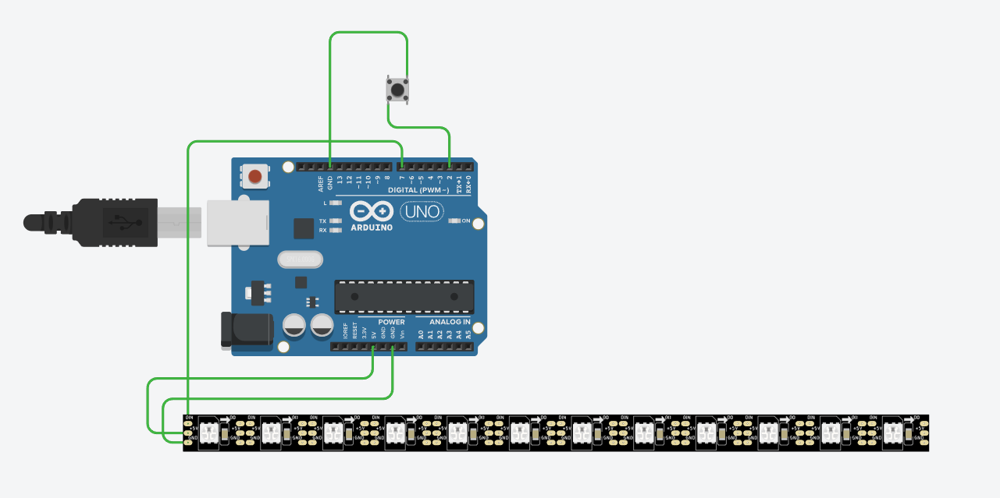

1. Прекъсвания

attachInterupt

Разлика между RISING  and falling

Събитие се случва, което процессора трябва да обработи най-бързо и прекъсва процеса който е сега

- запазва текущия процес в stack-а 
- изпълнява interupt-та
- връща се към текущия процес

- външно/хардуерно
- софтуерно -> пример за грешки:
    - Segmentation fault
    - делене на нула
    -> иначе sys calls
- като дойде пакет по uart, i2c - може да доведе до прекъсваме


voatile - компилатора прави оптимизации, които чупят кода (маха променливата) и затова преди променливата слагаме тая дума 

трябва в прекъсванията да са кратки 
да НЕ ползваме в тях:
- delay
- Serial.print 
- show метода на neopixel arduino


възможно е да имаме nested прекъсвания НООО при ардуино не работят прекъсвания, които са прекъсани от прекъсвания
в други контролери може да имаме приоритетни прекъсвания, а ако дойдат с една и съща приоритизация се ползва номер на прекъсването


2. Interfaces
Видове:
- Simplex
- Half-dublex
- Full-dublex

- peer to peer
- master slave /i2c, spi


- серийни 
- паралелен - едновременно се пращат множество битове, на множество проводници
- хибридни - сноп от серийни интерефейси на множество проводници


- синхронни - сигнал за данни + сигнал за тактова честота (сигнал за кога трябва да четем)
- асинхронни - сигнала за тактова честота не се праща отделно/директно а е кодиран в сигнала за данни и оттам може да се извелче
UART, Ethernet


по физическа среда:
- по оптичен кабел
- по медна жица


bit rate - колко информация се предава за секудна
baud rate - Колко символа се предават за секунда


3. светодиодни ленти
вързани са:
изхода на първия с входа на втория и т.н

пращаме 3 байта на цвета на първия и си ги запазва
после пращаме още 3 байта и те се записват във втория
и т.н

show method - павен

4. Servo библиотека
servoAttach
servoWrite

5. GPIO и регистри
Как да прочетем 4 пина едновременно

Data direction register - вход или изход
Port register - ако е изход / какво е нивото
Pin -  входно - какво има/ четем, нооо когато искаме Pull up resistor ако искаме - трябва единица 


6. Мотори
H-bridge - на кръст отпушваме за да върви - на редица за спирачка

скорост - pwm

7. други
Idea:
Библиотека за таймери на ардуино


Вредно е човек да си бие ток с еднакъв поляриетет щото разместя електроритите  


Упражнение от тест:



```c
#include <Adafruit_NeoPixel.h>

#define PIN 7
#define NUMPIXELS 12

void button_pressed_ISR(void);

volatile uint8_t ledState = 0;

Adafruit_NeoPixel pixels(NUMPIXELS, PIN, NEO_GRB);


void setup() {
  // put your setup code here, to run once:
  pinMode(2, INPUT_PULLUP);
  attachInterrupt(digitalPinToInterrupt(2), button_pressed_ISR, FALLING);
  pixels.begin();
  pixels.setBrightness(50);
  	 pixels.setPixelColor(6, pixels.Color(255,255,0));
}

void loop() {
  pixels.show();
	
}


void button_pressed_ISR (){
  if(ledState){
    ledState = 0;
	 pixels.setPixelColor(6, 255, 255, 0);
  }else{
    ledState = 1;
	 pixels.setPixelColor(6, 0, 0, 255);

  }
}
```


timer interupt mask register
кои прекъсвания се задават от таймера

първо си спираме прекъсанията и таймера го зануляваме


ползва се за многозадачност


ОБРАБОТЕННИ ЗАПИСКИ


### Подробно обяснение на всички теми от задачата:

---

## **1. Прекъсвания (Interrupts)**

### **Какво е прекъсване (interrupt)?**
Прекъсванията са специални събития, които сигнализират на процесора да спре текущото си изпълнение и да изпълни специален код, наречен ISR (**Interrupt Service Routine**). След приключване на ISR, процесорът продължава оттам, където е прекъснал.

#### **Хардуерно прекъсване**
- Външни събития, като натискане на бутон или приемане на данни по UART/I2C, генерират хардуерно прекъсване.
- Пример: Натискане на бутон (FALLING или RISING).

#### **Софтуерно прекъсване**
- Прекъсвания, породени от софтуер: например, грешка при изпълнение (делене на нула) или системни извиквания (sys calls).

---

### **RISING vs. FALLING**

- **`RISING`**: Прекъсване възниква, когато сигналът се промени от LOW към HIGH (нарастващ фронт).
- **`FALLING`**: Прекъсване възниква, когато сигналът се промени от HIGH към LOW (спадащ фронт).

---

### **Как работят прекъсванията?**
1. Текущото състояние на процесора се запазва в **стека**.
2. Изпълнява се ISR.
3. След края на ISR, процесорът възстановява запазеното състояние и продължава изпълнението.

---

### **Примерен код с прекъсване**

```cpp
#include <Adafruit_NeoPixel.h>

#define PIN 7
#define NUMPIXELS 12

// Декларация на променлива, използвана в ISR
volatile uint8_t ledState = 0;

Adafruit_NeoPixel pixels(NUMPIXELS, PIN, NEO_GRB);

void button_pressed_ISR(); // Прототип на ISR

void setup() {
  pinMode(2, INPUT_PULLUP); // Настройка на пин 2 като вход с Pull-Up
  attachInterrupt(digitalPinToInterrupt(2), button_pressed_ISR, FALLING); // Прекъсване на спадащ фронт

  pixels.begin();
  pixels.setBrightness(50);
  pixels.setPixelColor(6, pixels.Color(255, 255, 0)); // Първоначален цвят
}

void loop() {
  pixels.show(); // Изобразяване на NeoPixel
}

void button_pressed_ISR() {
  if (ledState) {
    ledState = 0;
    pixels.setPixelColor(6, pixels.Color(255, 255, 0)); // Жълт
  } else {
    ledState = 1;
    pixels.setPixelColor(6, pixels.Color(0, 0, 255)); // Син
  }
}
```

---

### **Важно за прекъсванията:**
1. **`volatile`**:
   - Компилаторът може да прави оптимизации, които "махат" променливи, ако сметне, че те не се променят. Затова се използва ключовата дума `volatile`, за да предупредим компилатора, че променливата може да се промени извън текущия поток на изпълнение (например, в ISR).

2. **В ISR:**
   - Трябва да са кратки.
   - Да се избягват `delay()`, `Serial.print()`, или тежки операции като `pixels.show()`.

---

## **2. Интерфейси**

### **Основни типове интерфейси**
1. **Simplex**:
   - Еднопосочна комуникация.
   - Пример: Радиопредаване.

2. **Half-Duplex**:
   - Двупосочна комуникация, но в един момент може да се изпраща или приема.
   - Пример: UART.

3. **Full-Duplex**:
   - Двупосочна комуникация едновременно.
   - Пример: Ethernet.

---

### **Паралелни и Серийни**
- **Паралелни**:
  - Множество битове се предават едновременно по няколко проводника.
  - Бързи, но изискват повече проводници.
- **Серийни**:
  - Предаване на битове един след друг.
  - Пример: I2C, SPI.

---

### **Синхронни и Асинхронни**
- **Синхронни**:
  - Имат сигнал за тактова честота (кога да четем данни).
  - Пример: SPI.
- **Асинхронни**:
  - Нямат отделен сигнал за тактова честота.
  - Пример: UART.

---

## **3. Светодиодни ленти**

- **NeoPixel** (WS2812):
  - Пикселите са последователно свързани.
  - Цветовете се изпращат като 3 байта (за RGB).
  - Използва се методът `show()` за обновяване.

Пример:
```cpp
pixels.setPixelColor(0, pixels.Color(255, 0, 0)); // Първи пиксел в червено
pixels.show();
```

---

## **4. Servo Библиотека**

### **Основни методи**
1. `servo.attach(pin)`:
   - Свързва серво мотор към определен пин.
2. `servo.write(angle)`:
   - Задава ъгъл на сервото (0 до 180 градуса).

Пример:
```cpp
#include <Servo.h>

Servo myServo;

void setup() {
  myServo.attach(9);
}

void loop() {
  myServo.write(90); // Сервото се завърта на 90 градуса
}
```

---

## **5. GPIO и регистри**

### **Основни регистри**
1. **DDR (Data Direction Register)**:
   - Определя дали пинът е вход или изход.
2. **PORT**:
   - Определя нивото на изходен пин.
   - Активира Pull-Up резистор на входен пин.
3. **PIN**:
   - Чете текущото състояние на пина.

### **Четене на 4 пина**
```cpp
uint8_t value = (PIND & 0b1111); // Чете първите 4 бита от порт D
```

---

## **6. Мотори**

### **H-Bridge**
- Използва се за управление на посоката на въртене.
- **На кръст включени транзистори**:
  - Позволява моторът да се върти в двете посоки.
- PWM се използва за контрол на скоростта.

---

## **7. Таймери**

### **Пример за настройка на таймер**
1. Спрете прекъсванията:
   ```cpp
   cli();
   ```
2. Занулете таймера:
   ```cpp
   TCNT1 = 0; // Занулява таймер 1
   ```
3. Маска за прекъсвания:
   ```cpp
   TIMSK1 |= (1 << TOIE1); // Активира прекъсване за таймер 1
   sei(); // Включва прекъсванията
   ```


  LINK към CHAT-a за повече обяснения - https://chatgpt.com/share/674ce23b-2284-8003-ad37-5f17b956ab63