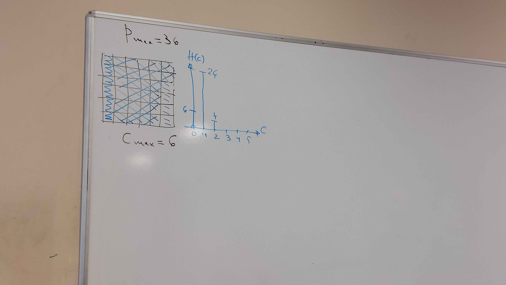
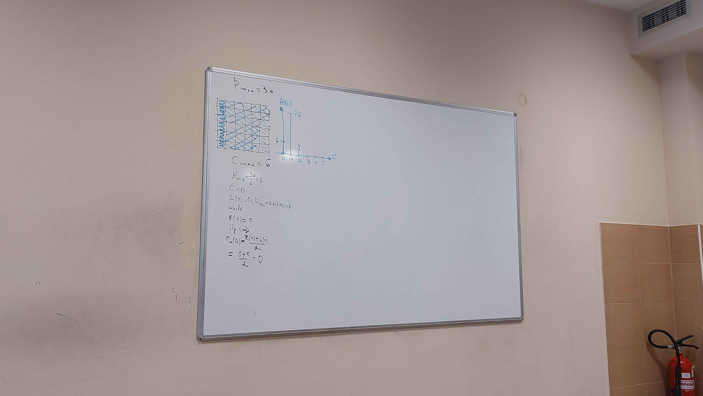
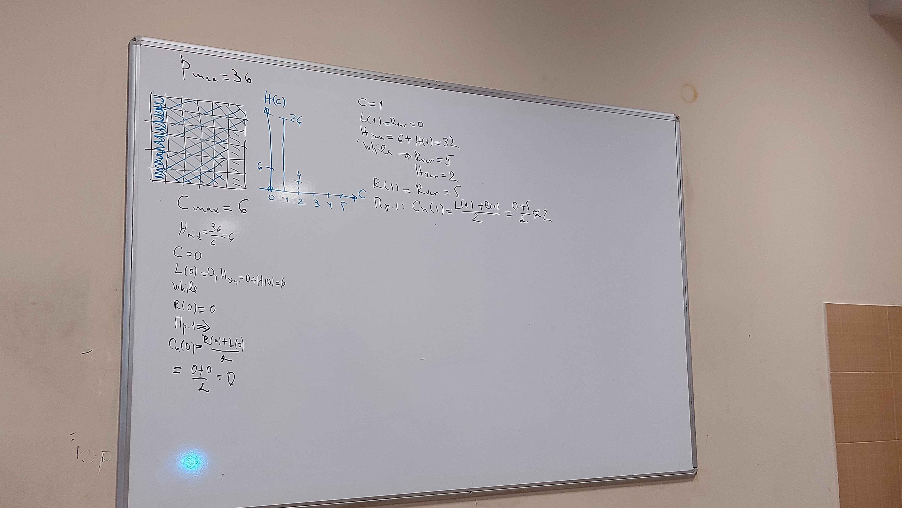
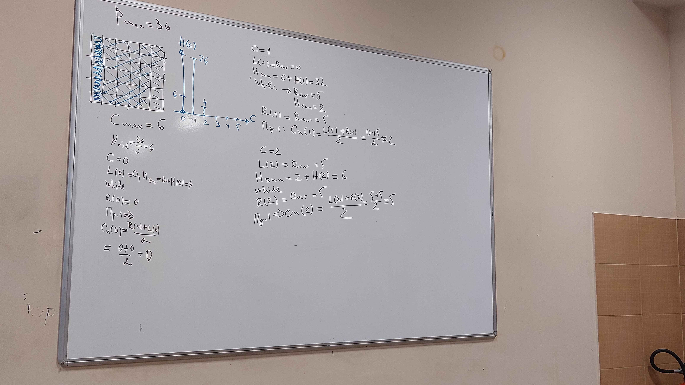
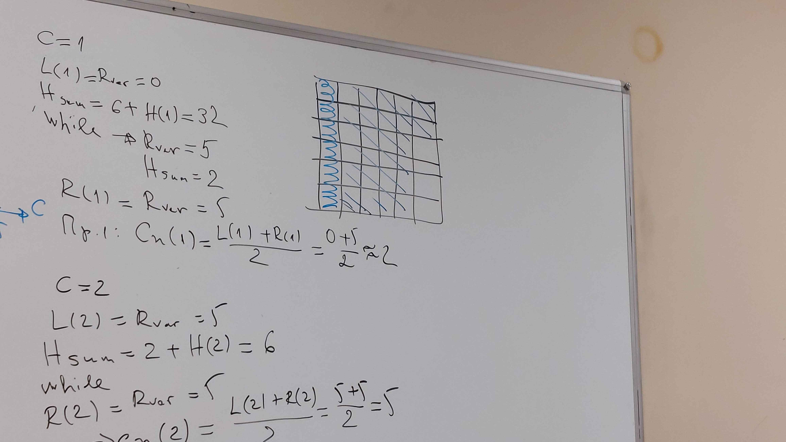
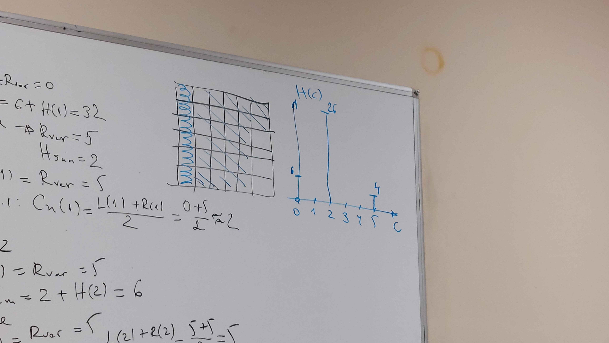
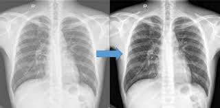

# Хистограма на изображение

# Алгоритъм за изравняване на хистограма

Този файл описва алгоритъм за изравняване на хистограма, който подобрява контраста на изображението чрез преразпределяне на интензитетните стойности.

## Променливи

- `H(C)`: Масив за хистограмата на всяка стойност `C`.
- `Co`, `Cmax`: Минимална и максимална стойност на хистограмата.
- `Cn`: Коригирана стойност на хистограмата след изравняване.
- `Po`, `Pmax`: Диапазон на индексите на пикселите.
- `Hmid`: Медиана на хистограмата.
- `Hsum`: Сума на стойностите в хистограмата.
- `Rver`: Променлива за брояч или текуща сума.

## Стъпки на алгоритъма

1. **Инициализиране на хистограмата**
   - Обхождаме пикселите от `Po` до `Pmax`.
   - Увеличаваме стойността в хистограмата `H(C(P))` за всяка стойност на пиксел `P`.
   - Нормализираме хистограмата чрез разделяне на броя пиксели.

   ```pascal
   For P = Po to Pmax do
       H(C(P)) = H(C(P)) + 1;
       Hmid = SUM(H(C)) / number(P) / number(C);
   ```

2. **Нулиране на брояча**
   - Задаваме начални стойности за брояча и сумата на хистограмата.

   ```pascal
   Rver = 0;
   Hsum = 0;
   ```

3. **Коригиране на стойностите на хистограмата**
   - Обхождаме стойностите `C` от `Co` до `Cmax`.
   - Изчисляваме лявата граница `L(C)` като текущата стойност на брояча `Rver`.
   - Натрупваме стойностите в хистограмата в променливата `Hsum`.
   - Когато `Hsum` надхвърли `Hmid`, актуализираме брояча и нулираме `Hsum`.

   ```pascal
   For C = Co to Cmax do
   begin
       L(C) = Rver;
       Hsum = Hsum + H(C);
       while Hsum > Hmid do
       begin
           Hsum = Hsum - Hmid;
           Rver = Rver + 1;
       end;
       R(C) = Rver;
   ```

4. **Методи за корекция**
   - Използват се три различни метода за коригиране на стойностите на хистограмата:
     - **Метод 1:** Средна стойност между лявата и дясната граница.
     - **Метод 2:** Случайна стойност между границите.
     - **Метод 3:** Допълнителен метод, който трябва да бъде доразвит.

   ```pascal
   case of
       method 1: Cn(C) = (L(C) + R(C)) / 2;
       method 2: Cn(C) = Random[L(C), R(C)];
       method 3: Go to...
   ```

5. **Прилагане на коригирани стойности**
   - Използване на коригираните стойности `Cn(C)` за всеки пиксел.

   ```pascal
   For P = Po to Pmax do
   begin
       case of
           method 1, 2: C(P) = Cn(P);
           method 3: Други операции...
       end;
   end;
   ```

---

### Край на алгоритъма

Този алгоритъм извършва изравняване на хистограмата чрез повторно разпределение на интензитетните стойности на пикселите в изображението, което води до по-добро визуално качество.


## Алгоритъм в снимки








---

Кога се ползва:
- Промяна на броя на цветовете - изчислява се хистограмамта за сстария брой цветове но искаме да го reduce-нем примерно на 16 и казваме че Cmax = 16
- за подобряване на констрастта (например - ренгеновите снимки, снимки които са от космкоса) 




---
---
---
---
# RAW Notes (might be useful)
Изравняване


L(C) - най-лявата част на "масива"
R(C) - най-дясната

Методи:

1. Cn = (L(C) + R(C))/2
2. CN=Random [L(C),R(C)]
3. Cmid за всяла т.P - околност


Cn=Cmid, ако Cmid принадлежи  на интервала [L(C), R(C)]

*снимка от 

H(C) - хистограма - масив

C0 - първия цвят
Cmax - последния цвят

P0- първата точка Pmax-последната точка при обхождане

Cn - текущата цвят

Hmid - средна стойност на христограмата
Hsum - променлива която събира всички цветове

Rver - колко пъти Hsum > Hmid


христограма
по х - интензитет, цветовете
по y - брой точки с този интензитет

