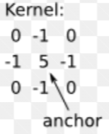

# Дефиниция

- **Филтриране на изображение** е процес на промяна на изображението чрез модифициране на цветовете на пикселите.

- Филтрирането включва т.нар. **операции на съседство**:
    - За всяка точка \( P \) филтърът разглежда околността около нея и, в зависимост от цветовете на околността и функцията на филтъра, променя цвета на точката \( P \).



# Видове филтри

## Според вида на филтриращата функция

- **Линейни филтри**
- **Нелинейни филтри** – използват се главно за специални визуални ефекти

### Линейни филтри

Линейните филтри могат да бъдат класифицирани по няколко признака:

- **Симетрични** и **Несиметрични** – в зависимост от симетрията на филтриращата маска
- **Нормировани** (scale = 1) и **Ненормировани** (scale = брой точки) – в зависимост от сумата на коефициентите в маската
- **Насочени** и **Ненасочени** – според това дали функцията се променя в зависимост от посоката

**Примери за линейни филтри:**

Ето коригирания текст с по-четими форматирани маски и описания:

---

**Средноаритметичен филтър**: Заменя стойността на всеки пиксел със средната стойност на неговите съседи.

Примерна маска:
```
 _________
|  1  1  1  |
|  1  1  1  |  × 1/9
|  1  1  1  |
|_________|
```

---

**Гаусово размазване**: Използва гаусово разпределение за размазване на изображението, като намалява шума и детайлите.

Примерна маска:
```
 _________
|  1   2   1  |
|  2   4   2  |  × 1/16
|  1   2   1  |
|_________|
```

---

**Филтър за изостряне**: Подчертава ръбовете и детайлите в изображението.

Примерна маска:
```
 _________
|  0  -1   0  |
| -1   5  -1  |
|  0  -1   0  |
|_________|
```

### Нелинейни филтри

При нелинейните филтри изображението се разделя на области, като се изчислява дисперсията на цвета във всяка област. Ако дисперсията надвишава определена стойност, областта се разделя на по-малки подобласти. В противен случай областта се запълва със средния цвят.

#### Дисперсия (средна квадратична грешка)

- **Дисперсия на цвета** – измерва степента на вариация на цветовете в дадена област. Показва колко близки са стойностите на пикселите един до друг.

**Как се изчислява:**

Представете си област от пиксели:

```
_________
| C1 C2 C3 |
| C4 C5 C6 |
| C7 C8 C9 |
|_________|
```

1. **Средна стойност на цвета** (\( C_{mid} \)):

Формулата изчислява средната стойност на всички пиксели в дадена област:
```
C_mid = (C1 + C2 + ... + Cn) / n
```
където:
- \( C1, C2, ..., Cn \) са стойностите на пикселите.
- \( n \) е броят на пикселите в областта.

---

2. **Дисперсия** (\( D \)):

Формулата измерва степента на разсейване на стойностите на цветовете около средната стойност:
```
D = sqrt(((C1 - C_mid)^2 + (C2 - C_mid)^2 + ... + (Cn - C_mid)^2) / n)
```
където:
- \( C_{mid} \) е средната стойност на пикселите (изчислена по горната формула).
- \( C1, C2, ..., Cn \) са стойностите на пикселите в областта.
- \( n \) е броят на пикселите.

3. **Критерий за разделяне**:

   - Ако \( D > \varepsilon \) (зададена граница), областта се разделя на по-малки области.
   - Ако \( D \leq \varepsilon \), областта се запълва със средния цвят \( C_{mid} \).

**Пример:**

- **При \( D > \varepsilon \)**:

  ```
  ______
  | C1 C2 |
  | C3 C4 |
  |______|
  ```

  Продължава се с разделянето.

- **При \( D \leq \varepsilon \)**:

  ```
  _________
  | Cmid Cmid |
  | Cmid Cmid |
  |_________|
  ```

  Областта се запълва със средния цвят.

**Областите могат да бъдат:**

- Квадрати
- Многоъгълници

**Примери за нелинейни филтри:**

1. **Медианен филтър**: Заменя стойността на пиксела с медианната стойност от неговите съседи. Ефективен за премахване на шум тип "сол и пипер".

2. **Максимален и минимален филтър**: Използват се за подчертаване на ярки или тъмни детайли в изображението.

## Инструменти за филтриране

- **GIMP**: Свободен софтуер за обработка на изображения, който предоставя разнообразие от филтри и ефекти.

# Примери

- Повече информация за ядра в обработката на изображения може да се намери в [Уикипедия](https://en.wikipedia.org/wiki/Kernel_%28image_processing%29).

# Допълнителни примери

## Линейни филтри

### 1. **Собел филтър**:

Използва се за откриване на ръбове чрез изчисляване на градиента на яркостта.

- **Хоризонтален Собел оператор**:

  \[
  \begin{bmatrix}
  -1 & 0 & 1 \\
  -2 & 0 & 2 \\
  -1 & 0 & 1 \\
  \end{bmatrix}
  \]

- **Вертикален Собел оператор**:

  \[
  \begin{bmatrix}
  -1 & -2 & -1 \\
   0 &  0 &  0 \\
   1 &  2 &  1 \\
  \end{bmatrix}
  \]

### 2. **Лапласиански филтър**:

Използва втори ред производни за откриване на области с бърза промяна на интензитета.

- **Примерна маска**:

  \[
  \begin{bmatrix}
   0 & -1 &  0 \\
  -1 &  4 & -1 \\
   0 & -1 &  0 \\
  \end{bmatrix}
  \]

## Нелинейни филтри

### 1. **Билатерален филтър**:

Комбинира пространствена близост и сходство на интензитета, за да запази ръбовете, докато премахва шума.

### 2. **Адаптивен медианен филтър**:

Разширява размера на околността в зависимост от локалните характеристики на изображението, за по-ефективно премахване на шума.

# Заключение

Филтрирането на изображения е ключова техника в компютърната графика и обработката на изображения. Разбирането на различните видове филтри и тяхното приложение позволява подобряване на качеството на изображенията и създаване на специални визуални ефекти.