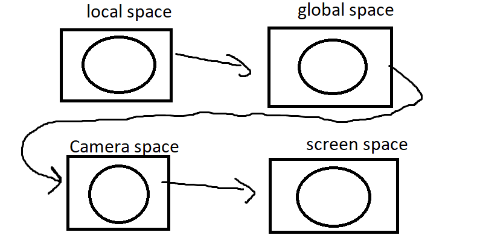
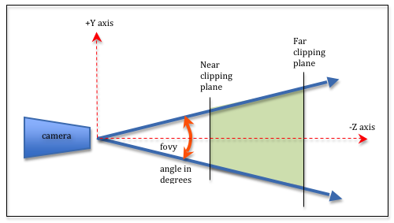
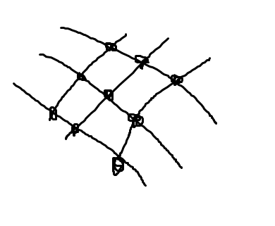
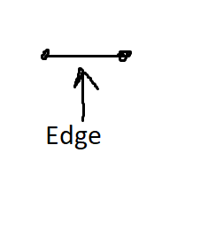
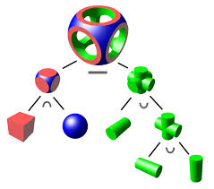

3D графика

- моделиране
- rendering

Rendering Pipeline

- квадратите са spaces
- кръговете - Processes

3D scene -> 2d scene 

в local space се извършва моделиране на 3д обекти спрямо локална координатна система

в global space се задават (Повърхностите):
- texture
- lights
- camera

В camera space-a

- clipping - премахване на телата извън пространството
- back-face clipping - Махане на неща които са невидими

В screen space-a има няколко process-a:
- rasterization
- z-buffer
- shading:
    - Ray tracing
    - Radiosity 

Mоделиране на 3Д обекти
Моделиране - създаване, разчерване
То се извършва в локално пространство

1) wireframe

2) Surface

3) Solid
Състои се от булеви операции

Може да има цяло дърво като листата накрая са точни математически обекти (сфера, пирамида, цилиндър...)

4) Spline

5) Движение на 2D Pattern по 3D path (f lifting)

6) Аналитични геометрия

7) Polygonal model
Процес:
Object -> surfaces -> polygouns -> facets:
 ->vertices
 ->normals

